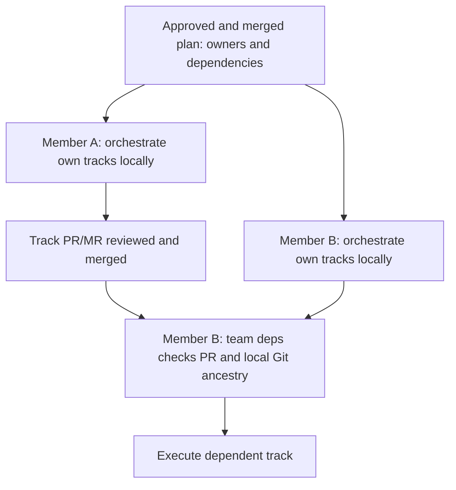

# Teamwork Hardening — Design

Date: 2026-10-06
Status: draft, awaiting user review of this written spec
Workflow ID: `teamwork-hardening`
Extends: [Team Mode](2026-10-03-team-mode-design.md)

## Goal and scope

Make the existing team workflow reliable when members use Claude Code on separate machines and orchestrate their own work from an approved, merged plan. Beads and lifecycle events remain local to each member. Git and the Git host provide the shared plan, ownership, review evidence, and integration status.

The user selected teamwork hardening after an evaluation of team support, workflow effectiveness, and token consumption. During spec review, the user proposed using the existing local-Beads path instead of synchronizing Beads between members. This revision adopts that direction: omit `team.beads_sync` for the target workflow and remove distributed claim/sync hardening from this change.

The deliverable covers approval provenance and freshness, unambiguous ownership, repeatable local orchestration, dependency code availability, stable branch identity, and accurate member-versus-feature completion reporting. Claude is the execution/review scenario; GitHub and GitLab remain supported hosts. Existing single-provider review uses a fresh Claude session.

## Evidence motivating the change

The assessment used repository commit `44becc54ea5292f928ff345d1e754d34e433aed2`:

- `gin-team` already supports local orchestration without `team.beads_sync`, including `external: <plan>#<N>` placeholders for dependencies owned by another member.
- That path also permits members to take unowned tracks in their area. Independent local claims cannot prevent two members from taking the same unassigned track.
- `team.py:check_approval` accepted an unrelated merged PR for `requirement_confirmed`, and accepted an empty plan under `area_lead`. These were reproduced with in-memory inputs.
- `_approver_roles` accepted an unknown approval commit when checking the current head. The GitLab adapter currently supplies an empty approval commit.
- `lifecycle_cli.py` derives verification from the existence of a recorded event without checking a recorded verified head.
- `team deps` closes an external placeholder when a matching PR merges, without establishing that the merged code exists in the dependent workspace.
- Team branch naming uses local epic identity plus area, which is neither a shared track identity nor sufficient to distinguish concurrent tracks in one area.

The 76 existing tests selected during the assessment passed. The additional gate probes exposed coverage gaps; neither result demonstrates a live, multi-member Git-host workflow.

## Approach and decisions

Build on the existing local mode, `team deps`, Beads claims, PR/MR template, host adapters, and gate validator. No shared database, new coordination service, or replacement task tracker is required.

| Decision | Rule |
|---|---|
| Shared allocation | Each executable track has one explicit `Owner:` in the approved, merged plan |
| Shared track identity | Repository identity plus plan path and stable track number; local bead IDs are not shared identifiers |
| Local orchestration | Each member creates only their assigned executable tracks and the external placeholders those tracks need |
| Cross-member delivery | Matching PR/MR merged into the plan's integration target, with the resulting code present in the dependent workspace |
| Same-member delivery | Local dependency closure plus reviewed output present in the selected workspace; merge is not required between local tracks |
| Progress | Beads answers local progress; PR/MR evidence answers cross-member integration progress |
| Shared Beads compatibility | Existing opt-in configuration remains available; hardening or removing it is outside this change |

This removes Beads network synchronization and distributed-claim recovery from the normal team path. It does not establish a measured token-saving percentage. Cross-member dependencies may wait longer because their handoff boundary is a merged PR/MR; stacked, unmerged cross-member work is outside this design.

## State ownership and data flow

| Information | Authority |
|---|---|
| Agreed scope, track allocation, dependencies, integration target | Approved, merged spec and plan in Git |
| Local task status, claims, dependency graph and closure | Each member's Beads database |
| Reviews, PR/MR status and integration commits | Git host |
| Code available in a workspace | Local Git history and working tree |
| Locally recorded gate evidence | Existing local workflow event store |
| Branch/worktree locations | Existing disposable runtime metadata |

A teammate validates the same specification and plan PRs to reconstruct local gate evidence. They do not rerun discovery/planning or obtain new approvals for unchanged artifacts. Beads databases and event stores are not copied or synchronized between members.

## Requirements

### 1. Bind approvals to the intended work

Role-gated team `record` and `team check` share a validator and require an explicit workflow ID. The plan supplies the shared feature/workflow identity; skills do not rely on `default-workflow`.

Resolve the expected code repository from the workflow's Git remote, not the evidence URL. SSH and HTTPS representations of the same host/project compare equal; a different project or host is rejected. An ambiguous upstream requires an explicit selection.

For `requirement_confirmed`, select the expected spec explicitly or from existing workflow evidence; add a `--spec` selector alongside the existing `--plan` selector. For `plan_approved`, select the expected plan the same way. An initial record without an unambiguous artifact reports the missing selector rather than choosing the first Markdown file.

Selected paths must stay within the repository and applicable legacy/SDD layout. The artifact must be among the PR/MR changes. Validate its content at the reviewed revision and establish that the accepted merged result retains that content. Local edits and same-named artifacts from other PRs are not evidence. Plan evidence references the confirmed spec; feature PR/MR evidence identifies the approved plan and delivered tracks through the existing template fields.

Plan metadata records the shared workflow identity and target integration branch. Every executable track has a unique, stable number, eligible `Owner:`, explicit dependencies, and valid file scope. Require an area when areas are configured. Reassignment or changes to scope/dependencies go through a reviewed, merged plan revision; do not renumber existing tracks or recycle their identity for different work.

Run these checks inside gate validation, even if `team check-plan` was skipped. Empty plans, duplicate tracks, missing/ineligible owners, unknown areas and out-of-area files reject the gate. Preserve role-list semantics: an eligible non-author approver from the configured list suffices; `area_lead` requires approval coverage for every area in the valid plan.

Record repository/workflow identity, artifact paths and hashes, PR/MR URL, reviewed head, merge result where applicable, and approver provenance in the gate event. Both `record` and read-only `team check` accept the same selectors.

### 2. Require current approval evidence

Unknown approval revision is not equivalent to the current revision. GitHub reviews must demonstrate approval for the accepted PR head. GitLab must supply revision-bound evidence or host evidence establishing that the approvals apply to the current revision and were invalidated by intervening pushes. A bare `approved_by` list is insufficient.

When the host cannot establish freshness, report the missing capability and hold the gate. Read the head consistently around approval retrieval; a concurrent head change rejects the attempt for revalidation. Before consuming a role-gated approval to advance a stage or ship, recheck host evidence so revoked approvals do not remain valid indefinitely.

For verification, the approved source head equals the local feature `HEAD`, and the index/worktree has no uncommitted changes affecting the verified result. Record the verified head/tree. A new source commit or dirty source change invalidates that verification. Event replay must not treat any historical `verification.passed` event as approval for the current source.

Changed spec/plan content invalidates its approval and dependent evidence in that local workflow. Unrelated commits leaving the artifact hashes unchanged do not require repeating specification approval. A verified source head may authorize its own merge; the integration result still receives the existing post-merge checks.

Offline status may display recorded evidence but must distinguish it from a currently validated gate. Existing team events without artifact/revision binding remain audit history and require revalidation before use.

### 3. Orchestrate and claim only locally assigned work

After the plan merges, each member fetches the approved plan and referenced spec, validates their gate evidence, and orchestrates the tracks whose `Owner:` matches their configured identity. Membership in an area alone does not allocate its unowned tracks.

Use the shared repository/plan/track identity to find existing local beads. Repeating orchestration reuses them, preserves their status and notes, and does not create duplicate tasks, epics, or placeholders. Keep this mapping in existing Beads metadata, not a second durable task registry.

Dependencies owned by the same member become local Beads edges. A dependency owned by another member becomes a local `external: <plan path>#<track number>` placeholder. Create only the placeholders needed by local tracks; do not mirror other members' executable tasks.

Use the supported explicit Beads actor argument and native atomic local claim. Recheck ownership, member eligibility and dependency readiness at claim time. Local claims coordinate sessions sharing that database; they do not represent a distributed lock. The reviewed `Owner:` allocation prevents normal cross-member duplicate execution. Multiple independent clones belonging to the same owner still require that member to coordinate their sessions.

Before new execution, compare with the latest approved plan revision. If a track was reassigned, the previous owner cannot start it based on stale local metadata. Preserve existing work and report a handoff when an in-progress track changes owner; do not reset, delete, or automatically transfer its database records. Offline work on an already claimed track may continue, but a new assignment or ownership decision requires current plan evidence.

### 4. Resolve dependency code and use stable branches

Extend `team deps` rather than adding a separate dependency service or command. Resolve cross-member dependencies using the code repository, approved plan identity, stable track number, and integration target. A title or unchecked PR body is not sufficient: confirm the PR/MR belongs to the expected repository, references the approved plan revision and track, has the expected owner's delivery or a reviewed handoff, and merged into the intended target branch.

The template retains `Plan:` and `Tracks:` and carries the approved plan revision so a PR for an older, superseded track scope cannot satisfy the current dependency. A newer plan revision that changes only unrelated tracks does not invalidate that delivery: compare the referenced track's requirements, owner, dependencies and integration target. If more than one candidate is ambiguous, hold and report the candidates rather than accepting the first search result. Search pagination must not silently hide a matching delivery.

A merged PR/MR resolves an external placeholder only when its host-confirmed integration commit is an ancestor of the selected workspace `HEAD`. This handles merge, squash, and rebase through their actual integration result. Missing objects or missing ancestry produce an actionable fetch/update message and leave the placeholder open. Do not merge or cherry-pick automatically. A PR into the wrong target or an open PR does not unblock cross-member work.

For same-member dependencies, local closure plus the reviewed output commit being present in the workspace suffices. Record that local output commit in existing bead metadata when closing a track. It need not be published or merged before the next local track. Different local branches still need an explicit integration step before the dependent code is usable.

Run dependency validation after selecting the execution workspace and immediately before implementation, including previously resolved dependencies. Changing worktrees must not let an old closed placeholder stand in for absent code. Hold execution without erasing the historical delivery evidence.

New track branches use `feat/<workflow-id>-<area>-t<track-number>` with Git-valid components. When no area is configured, omit that component. Shared workflow IDs must be unique within the repository. Two tracks in the same area get distinct names; two members referring to the same plan track derive the same name regardless of local bead IDs.

Reuse already-recorded branches/workspaces for ongoing tracks. An intentionally shared sequential branch remains valid when recorded in the approved execution arrangement. No existing branch is renamed automatically.

### 5. Distinguish local delivery from whole-feature completion

Each local epic represents that member's assigned portion of the approved plan. Closing all of its tracks means that portion is implemented and reviewed; it does not prove other members' work is complete. The local epic may be shipped when its delivered tracks have merged and passed the applicable checks. Report that scope explicitly.

Member verification checks the assigned requirements/tracks and their dependency integration. It must not claim that the entire spec has been verified when other tracks live only in other members' environments. Existing verification and handoff instructions must distinguish member scope from full-feature scope.

Whole-feature integration status is derived read-only from the approved plan's complete track set and matching PR/MR evidence. Report tracks as merged, open PR/MR, or no verifiable delivery; do not infer another member's in-progress state from missing PRs. A feature is reported as integrated only when every required track has valid merged evidence. Claiming whole-feature verification additionally requires the complete spec/plan checks on the combined integration revision.

Reuse existing progress, verification and host-query mechanisms. Do not introduce a shared Beads epic or a new mandatory lead-approval stage. Git-host evidence is refreshed at handoff and dependency checks, not through a background polling service.

## Errors and compatibility

- Exit 0 means the requested evidence, dependency, orchestration or local claim check succeeded.
- Exit 1 means rejected/stale evidence, invalid plan allocation, dependency not integrated, ambiguous delivery, or local claim contention.
- Exit 2 means missing tools/configuration/capabilities, invalid arguments, or unavailable host/authentication/network needed for the requested check.
- Failed gate validation writes no success event. Dependency refresh failure cannot silently unblock a task.
- Solo behavior is unchanged. Legacy and SDD layouts use the same rules without relocating their artifacts.
- Existing local team plans lacking owners must receive a reviewed allocation before new orchestration. Existing beads are reused/backfilled only when their plan/track identity can be established unambiguously.
- Existing shared-Beads installations and `team.beads_sync.remote` remain supported as before. This change neither removes their configuration nor modifies their sync recovery algorithm. Local-mode acceptance runs omit that configuration and must make no Beads remote calls.
- The current repository's team mode is not enabled or migrated as part of implementing these rules.

## Acceptance and validation

| Scenario | Required outcome |
|---|---|
| Valid spec/plan PR with expected repository, artifacts, roles and allocation | Reproducible artifact/revision-bound gate evidence |
| Foreign/unrelated PR, wrong artifact or mismatched plan | Gate rejected without a success event |
| Empty plan, duplicate tracks, missing/ineligible owner, invalid area/scope | Gate rejects even if `check-plan` was skipped |
| Old, missing-revision, dismissed or revoked approval | Does not satisfy the current gate |
| Head changes during approval retrieval, or source changes after verification | Revalidation required; stale evidence cannot authorize execution/ship |
| Two members orchestrate one merged plan in independent environments | Each gets only assigned executable tracks and needed external placeholders |
| Same member repeats orchestration | Existing bead identities, notes and status preserved; no duplicates |
| Member attempts an unowned or other member's track | Refused despite area eligibility |
| Approved plan reassigns an in-progress track | Previous owner gets a handoff hold; existing work preserved |
| Another member closes a local bead or opens a PR | No cross-member dependency is released |
| Matching PR merges but checkout lacks its integration commit | Placeholder stays open and execution holds |
| Correct merge/squash/rebase result is present locally | Dependency resolves for that workspace |
| Old closed placeholder used from a different, stale workspace | Execution holds despite prior resolution |
| Same-member dependency reviewed and present on the local branch | Next local track may start without a merge |
| Two same-area tracks; different local bead IDs across clones | Distinct per-track branches derived from shared plan identity |
| One member ships their local epic while another track remains open | Report member delivery only; whole feature remains incomplete |
| Every plan track merged and combined result freshly verified | Whole-feature completion can be reported with evidence |
| Local-mode workflow from orchestration through handoff | No Beads pull/push, shared claim, or remote database requirement |
| No team configuration | Existing solo behavior and host-call avoidance preserved |

Extend existing team/gate tests with deterministic GitHub/GitLab fixtures. Use temporary Git histories for artifact binding, plan amendments, dirty worktrees, branch identity, target validation and dependency ancestry. Use two independent local Beads databases to exercise assigned-track projection, repeated orchestration, and cross-member placeholder resolution without a Beads remote. Cover paginated/ambiguous PR results and failed host queries.

Use commands that fail the test if a Beads remote operation is attempted in local mode. Do not present mocked host tests as live provider validation. Record unavailable integration dependencies or skipped runs explicitly. Maintain skill instruction budgets and documentation checks for changed contracts.

## Documentation and boundaries

Update lifecycle, state model, team guide, CLI reference, templates, and affected skills so local ownership, dependency readiness, plan revisions, and completion scope agree. This spec supersedes the earlier shared-claim-hardening scope for this change, not the existing optional shared-Beads feature.

Token attribution/pricing, usage aggregation, framework benchmarks, provider routing changes, sync recovery, automatic remote creation, automatic branch-protection configuration and cross-member work on unmerged stacked branches are outside this change. Implementation planning and task creation follow review and explicit confirmation of this written spec.
