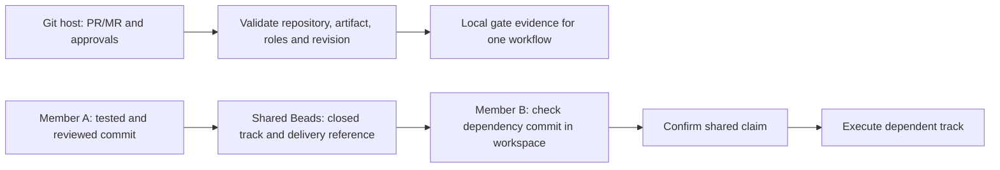

# Teamwork Hardening — Design

Date: 2026-10-06
Status: draft, awaiting user review of this written spec
Workflow ID: `teamwork-hardening`
Extends: [Team Mode](2026-10-03-team-mode-design.md)

## Goal and scope

Make the existing team workflow reliable when members use Claude Code on separate machines, work on separate branches, and share Beads through a Git repository configured by `team.beads_sync.remote`.

The user selected teamwork hardening from an evaluation of team support, framework effectiveness, and token consumption, then requested this spec. This change covers approval provenance and freshness, dependency code availability, branch identity, and safe Beads claims. It preserves the existing lifecycle and state owners; it does not introduce a coordination service.

Claude is the execution and review scenario for validation. GitHub and GitLab remain supported hosts. Review may use a fresh Claude session under the existing single-provider/session-independence policy.

## Evidence motivating the change

The assessment used repository commit `44becc54ea5292f928ff345d1e754d34e433aed2`:

- `team.py:check_approval` accepted an unrelated merged PR for `requirement_confirmed`, and accepted a plan with no tracks under the `area_lead` policy. These were reproduced with in-memory inputs.
- `_approver_roles` did not reject an approval with an unknown commit when checking the current head. The GitLab adapter currently supplies an empty approval commit.
- `lifecycle_cli.py` derives verification from the existence of a recorded event; that event does not carry a verified head for freshness checks.
- The execute skill closes tracks and unblocks dependents before merge. Across branches, a closed dependency does not establish that its code is present in the dependent workspace.
- Team branch naming is `feat/<epic>-<area>`, which cannot distinguish simultaneous tracks in the same area.
- A failed shared claim push invokes an embedded-only reset to `origin/main`. It does not distinguish a concurrent claim from an unavailable remote.

The existing 76 tests selected for team gates, usage, instruction budgets, and benchmark summaries passed during the assessment. The additional probes identified coverage gaps; they were not live Git-host or multi-machine tests.

## Approach

Extend the existing `team.py`, `team_host.py`, `team_beads.py`, `team_cli.py`, and lifecycle gate handling. Reuse Beads metadata, Git commits, host review evidence, and the existing event store.

An always-on shared Beads server is an alternative deployment, but it adds operation requirements and does not resolve approval or code-integration gaps. Replacing the team backend is outside this change.

## State ownership and data flow

| Information | Authority |
|---|---|
| Work, assignment, dependencies, closure, track delivery reference | Beads |
| Approved requirement and plan content | Versioned spec/plan at the reviewed Git revision |
| PR/MR identity, review state, reviewed revision, merge result | Git host |
| Code available in a member's workspace | Local Git history and working tree |
| Locally recorded gate evidence | Existing workflow event store |
| Worktree and branch locations | Existing disposable runtime metadata |

Gate events remain local. A teammate reconstructs local gate evidence by validating the same PR/MR against the same explicit workflow and artifacts. Merely pulling shared Beads does not satisfy local gates.

## Requirements

### 1. Bind approvals to the intended work

Role-gated team `record` and `team check` must use the same validation path and require an explicit workflow ID. Team skills always supply that ID instead of relying on `default-workflow`.

The expected code repository comes from the Git remote used by the workflow, not from the evidence URL. SSH and HTTPS representations of the same host/project compare equal; a different host or project is rejected. An ambiguous upstream must be resolved explicitly. The Beads storage remote is never treated as the code repository.

For `requirement_confirmed`, identify the expected spec explicitly or from existing evidence for that workflow. Add a `--spec` selector alongside the existing `--plan` selector. For `plan_approved`, identify the expected plan the same way. An initial record without an unambiguous artifact fails with a corrective command rather than choosing the first Markdown file.

Selected paths must stay within the repository and the applicable legacy or SDD artifact layout. The artifact must be part of the PR/MR's changes. Read and validate its content at the reviewed revision, and verify that the accepted merged result retains that content. A local edited file or a same-named file from another PR is not proof. Plan evidence must reference the confirmed spec for that workflow; feature verification must identify the approved plan and its tracks through the existing PR/MR template fields.

Run plan validation inside the gate validator, not only as an earlier skill instruction. An empty plan, duplicate track numbers, missing/unknown required areas, invalid owners, or files outside their declared areas must reject the gate. Preserve current role-list semantics: one eligible non-author approver from the configured list suffices; `area_lead` requires coverage for every area in the valid plan.

Record repository identity, workflow ID, artifact paths and content hashes, PR/MR URL, reviewed head, merge result when applicable, and approval provenance in the event payload. Selectors and evidence checks must be available to both `record` and read-only `team check`.

### 2. Require current approval evidence

Unknown approval revision is not equivalent to the current revision. GitHub reviews must demonstrate approval for the accepted PR head. GitLab must provide either revision-bound approval evidence or host evidence that approvals apply to the current revision and were invalidated by intervening pushes. A bare `approved_by` list is insufficient.

A host deployment unable to establish freshness reports the missing capability and holds the gate. Do not infer freshness from a successful API response or silently waive the check. Read the head consistently around approval retrieval; if it changes during validation, reject the attempt and request revalidation.

For verification, the approved source head must equal the local feature `HEAD`, and the worktree/index must contain no uncommitted changes affecting the verified result. Record the verified head and tree. Subsequent source changes make that evidence stale. State derivation must not report a current verification solely because an older `verification.passed` event exists.

Spec or plan content changes invalidate the corresponding approval and dependent lifecycle evidence for that workflow. Unrelated commits that leave those artifact hashes unchanged do not require repeating specification approval. A previous verified source head may authorize its own merge, but validation of the resulting integration commit still follows the existing ship checks.

Before consuming a role-gated approval to advance a stage or ship, recheck current host evidence so revoked approvals do not remain valid indefinitely. An offline status view may show recorded evidence, but must distinguish it from a currently validated gate. Existing team events lacking the required binding fields are retained for audit and require revalidation; they are not silently upgraded to trusted evidence.

### 3. Check dependency code before execution

Keep the distinction between a completed track and a shipped feature. A track may still close after its tests and independent review pass, without waiting for a PR merge.

Before closing a team track, commit and publish its reviewed output, then store a delivery reference in that bead's metadata: code repository identity, workflow/plan/track identity, full source commit SHA, and the branch or PR/MR through which the commit can be fetched. The published commit must match the tested and reviewed content. Sync this reference together with closure when shared Beads is enabled. Failure to publish the required reference prevents completion from being advertised to teammates.

Add a read-only `team check-deps <bead>` check for the selected execution workspace. It checks every blocking dependency's completion and delivery reference. Parent-child and informational links are not code dependencies. For a cross-member placeholder, retain the matching merged PR/MR and merge result when resolving it.

A dependency is usable when its recorded output commit is an ancestor of the workspace `HEAD`. For squash or rebase integration, the host-confirmed merge result is acceptable only when it is linked to the recorded delivered source revision and is present in local ancestry. Patch similarity or a shared commit message does not establish equivalence.

Missing objects, missing legacy delivery metadata, unknown integration provenance, or a dependency whose commit is absent produce a clear hold naming the bead and missing revision. The command reports the fetch/integration needed; it does not merge, cherry-pick, rewrite branches, or close tasks automatically.

The execute skill runs this check after workspace selection and immediately before implementation. `team claim` also checks current task readiness and member eligibility instead of trusting an earlier `team ready` listing. A `ready` result means graph readiness, not a guarantee that an arbitrary checkout contains dependency code.

### 4. Give concurrent tracks distinct branches

New team track branches use `feat/<epic>-<area>-<track-id>`, with a stable track identifier and Git-valid components. Two tracks in the same epic and area must receive different branches and isolated workspaces.

Reuse already-recorded branches/workspaces for ongoing tracks; do not rename existing branches or disrupt open PRs. An intentionally shared sequential branch remains reusable when the approved execution arrangement records it. Branch identity never replaces Beads ownership or task state.

### 5. Make shared claims safe and recoverable

Keep `team.beads_sync.remote` and the existing Dolt-through-Git deployment. Setup and doctor must verify that the database remote actually used by synchronization matches that configuration, and report the installed Beads capabilities required for reliable claims. Detect the configured remote/ref rather than assuming `origin/main`.

Use the supported explicit Beads actor argument for member identity. Ensure the claim change is included in the durable data being pushed; a successful push of older commits does not prove that a new claim was published.

The shared claim sequence is: synchronize current state, validate readiness/eligibility and ownership, perform the native atomic local claim, publish it, and confirm the resulting remote ownership. Only a confirmed claim returns success and permits execution. This is an optimistic distributed claim, not a promise that independent local databases provide a global lock.

On a competing claim, report the observed owner and stop. On network failure, timeout, or an ambiguous push response, report that claim ownership is unconfirmed and stop before execution. Preserve local database changes and expose the recovery action; do not assert that the remote did or did not accept the claim without checking it.

Remove automatic whole-database hard reset from the claim failure path. Safe recovery may use native Beads/Dolt operations that preserve unrelated updates; if those operations cannot establish a conflict-free state, leave it for explicit conflict resolution. A retry must reconcile the remote before publishing a previously unconfirmed claim or returning success. No force push is performed.

Embedded and server modes must either satisfy this contract through supported native operations or fail with an actionable capability error before changing ownership. The implementation must document the versions/modes it actually validates. Offline reads remain usable; offline execution cannot begin on a new, unconfirmed shared claim.

## Errors and compatibility

- Exit 0: validated evidence, dependencies available, or confirmed ownership, according to the command.
- Exit 1: rejected evidence, stale revision, missing dependency code, ownership contention, or a data conflict.
- Exit 2: missing configuration/tool capability, invalid command arguments, authentication/network failure, or an unconfirmed outcome caused by unavailable infrastructure.
- Failed gate validation appends no success event. Failed claims never return a success-shaped result.
- Preserve existing config keys and role semantics. No new database, remote service, or shared event log is required.
- Solo behavior is unchanged. Existing team approvals and deliveries are upgraded through explicit revalidation/backfill from verifiable Git evidence, not inferred from task closure alone.
- Legacy and SDD layouts use the same safety rules. This change does not migrate artifact directories or enable team mode in the current repository.

## Acceptance and validation

| Scenario | Required outcome |
|---|---|
| Valid spec/plan PR from the configured repository, expected artifact and roles | Gate records reproducible artifact/revision evidence |
| Foreign repository, unrelated PR, wrong artifact, or mismatched workflow plan | Gate rejected; no success event |
| Empty plan, duplicate track numbers, invalid area/owner/scope | Rejected by the gate itself, even if `check-plan` was skipped |
| Old, missing-revision, dismissed or revoked approval | Does not satisfy the current gate |
| PR head changes while reviews are being read | Attempt rejected for revalidation |
| Verification followed by a new source commit or dirty source changes | Prior verification no longer authorizes the changed result |
| Spec/plan edited after approval | Corresponding and dependent evidence becomes stale |
| Dependency closed on another branch; code absent locally | Execution holds with the missing delivery revision |
| Dependency output or proven squash/rebase integration is in local ancestry | Dependency check passes |
| Two tracks in one epic/area | Distinct new branch names; existing branches remain usable |
| Two clones race to claim one shared bead | At most one confirmed winner; the loser cannot execute |
| Push rejected or response lost after a possible remote write | No success until reconciliation; unrelated local changes survive |
| Non-default remote/ref, supported embedded/server mode | No hard-coded reset target; capability failures occur before ownership mutation |
| Same verified PR/MR checked on a second member's machine | Equivalent local gate evidence can be reconstructed |
| No team configuration | Existing solo behavior and host-call avoidance remain intact |

Extend existing team/gate suites with deterministic GitHub and GitLab fixtures. Use temporary Git histories for artifact provenance, dirty worktrees, branch identity, dependency ancestry, and squash/rebase cases. Exercise shared claims with two independent temporary Beads databases and a bare Git remote, including a coordinated race and an unrelated concurrent update.

Do not present mocked host tests as live provider validation. Record exact Beads/Dolt versions and modes for integration runs; missing capabilities or skipped runs remain explicit limitations. Maintain the existing skill instruction budgets and run documentation checks for changed CLI/skill contracts.

## Documentation and boundaries

Update the canonical lifecycle, state model, team guide, CLI reference, and affected team/lifecycle skills when implementing this design so track closure, code availability, approval freshness, and recovery instructions agree.

Token attribution, pricing, usage aggregation, framework benchmarks, provider routing changes, automatic remote creation, and automatic branch-protection configuration are outside this change. Implementation planning and Beads task creation follow review and explicit confirmation of this written spec.
