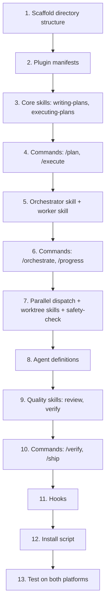

# Reusable Developer Workflow Plugin — Dual-Platform (Antigravity + Claude Code)

Build a single plugin named **`gin-workflow`** that provides plan-driven orchestration workflows and installs natively on both **Antigravity CLI** and **Claude Code**, based on the requirements in [README.md](file:///home/gin/infra/agent-plugin/README.md).

## Final Design Decisions

- **Plugin Name**: `gin-workflow` (slash commands namespaced as `/gin-workflow:plan`, etc.).
- **V1 Scope**: Focus on the core workflow command set: `/plan`, `/orchestrate`, `/execute`, `/verify`, `/progress`, `/ship` and their respective core skills (`bead-orchestrator`, `bead-worker`, `writing-plans`, `executing-plans`, `verification-before-completion`, `finishing-a-development-branch`). Remaining advanced/helper commands (`/debug`, `/discuss`, `/quick`, `/new-project`, etc.) will be staged for v2.
- **Git Worktree Security & Guardrails**: The plugin will support Git worktree isolation. To prevent hallucinating agents from executing incorrect or destructive commands during worktree setup/teardown, the orchestration engine will use a strict, read-only validation step and hardcoded shell scripts with explicit path checks. Crucially, a `PreToolUse` hook will intercept shell/tool executions to verify that actions are constrained within the designated worktree path.
- **Task Management Overlap (Beads vs. `agent-orchestration`)**: 
  - *Recommendation*: Use [Beads](https://gastownhall.github.io/beads/) as the local task-tracking engine. Storing beads (tasks) as Git-trackable files or using the Beads CLI directly removes the need for a running python SQLite backend (`agent-orchestration`).
  - *Action*: Deprecate the SQLite-backed task tracking in `agent-orchestration` and transition the plugin's task storage entirely to Beads.
- **Location**: The plugin will live inside the `agent-plugin/` directory in this repository during development, and will be migrated to its own repository later.
- **Config Cleanups**: Upon completing Phase 1, we will remove deprecated instruction rules in [CLAUDE.md](file:///home/gin/infra/CLAUDE.md), [.antigravityrules](file:///home/gin/infra/.antigravityrules), and `.cursor/` configs, replacing them with instructions that cleanly reference the new `gin-workflow` plugin.

---

## Proposed Architecture

### Platform Comparison

| Concept | Claude Code | Antigravity CLI |
|---|---|---|
| Project instructions | `CLAUDE.md` | `AGENTS.md` (or `.antigravityrules`) |
| Always-on rules | `CLAUDE.md` | `.antigravityrules` |
| Skills directory | `.claude/skills/<name>/SKILL.md` | `.agents/skills/<name>/SKILL.md` |
| Commands | `.claude/commands/<name>.md` | `.agents/commands/<name>.md` |
| Agents | `.claude/agents/<name>.md` | `.agents/agents/<name>.md` |
| Hooks config | `.claude/settings.json` → `hooks` key | `.agents/hooks/hooks.json` |
| Plugin manifest | `<plugin>/.claude-plugin/plugin.json` | `<plugin>/plugin.json` |
| Plugin install CLI | `/plugin install <name>@<marketplace>` | `agy plugin install <url>` |
| Plugin local test | `claude --plugin-dir ./my-plugin` | `agy plugin install ./local-path` |
| Env vars | `$CLAUDE_PLUGIN_ROOT`, `$CLAUDE_PROJECT_DIR` | Plugin context (similar) |
| Global skills | `~/.claude/skills/` | `~/.gemini/antigravity-cli/skills/` |
| Inspect loaded config | N/A | `agy inspect` |
| Reload plugins | `/reload-plugins` | Re-run `agy inspect` |

> [!NOTE]
> Both platforms use the **same primitives** (Markdown skills with YAML frontmatter, Markdown commands, Markdown agents, JSON hooks). The differences are almost entirely **directory naming** (`.claude/` vs `.agents/`) and **manifest location** (`.claude-plugin/plugin.json` vs root `plugin.json`).

### Strategy: Single source → dual output

```
agent-plugin/                          # ← canonical source (this repo)
├── plugin.meta.json                   # Shared metadata (name, version, description)
├── install.sh                         # Cross-platform install script
├── Plan.md                            # This plan
├── src/
│   ├── commands/                      # Slash command markdown files (Core v1)
│   │   ├── plan.md
│   │   ├── orchestrate.md
│   │   ├── execute.md
│   │   ├── verify.md
│   │   ├── ship.md
│   │   └── progress.md
│   ├── skills/                        # Reusable skill modules (SKILL.md format)
│   │   ├── bead-orchestrator/
│   │   │   └── SKILL.md
│   │   ├── bead-worker/
│   │   │   └── SKILL.md
│   │   ├── writing-plans/
│   │   │   ├── SKILL.md
│   │   │   └── plan-schema.md
│   │   ├── executing-plans/
│   │   │   └── SKILL.md
│   │   ├── dispatching-parallel-agents/
│   │   │   └── SKILL.md
│   │   ├── using-git-worktrees/
│   │   │   └── SKILL.md
│   │   ├── verification-before-completion/
│   │   │   └── SKILL.md
│   │   └── finishing-a-development-branch/
│   │       └── SKILL.md
│   ├── agents/                        # Specialist agent definitions (MD + YAML frontmatter)
│   │   ├── agent-researcher.md
│   │   ├── code-reviewer.md
│   │   └── codebase-mapper.md
│   ├── hooks/                         # Lifecycle hook definitions
│   │   └── hooks.json
│   └── scripts/                       # Supporting shell scripts (for hooks + worktree)
│       ├── worktree-create.sh
│       ├── worktree-cleanup.sh
│       └── merge-integration.sh
├── dist/                              # Generated by install.sh
│   ├── claude-code/                   # Claude Code plugin layout
│   │   ├── .claude-plugin/
│   │   │   └── plugin.json            # Generated from plugin.meta.json
│   │   ├── commands/                  # Copied from src/commands/
│   │   ├── skills/                    # Copied from src/skills/
│   │   ├── agents/                    # Copied from src/agents/
│   │   ├── hooks/                     # Copied from src/hooks/
│   │   └── scripts/                   # Copied from src/scripts/
│   └── antigravity/                   # Antigravity plugin layout
│       ├── plugin.json                # Generated from plugin.meta.json
│       ├── commands/                  # Copied from src/commands/
│       ├── skills/                    # Copied from src/skills/
│       ├── agents/                    # Copied from src/agents/
│       ├── hooks.json                 # Flattened from src/hooks/hooks.json
│       └── scripts/                   # Copied from src/scripts/
└── README.md
```

---

## Proposed Changes

### Component 1: Plugin Metadata & Manifests

#### [NEW] [plugin.meta.json](file:///home/gin/infra/agent-plugin/plugin.meta.json)
Canonical metadata file consumed by `install.sh` to generate platform-specific manifests.

```json
{
  "name": "gin-workflow",
  "version": "1.0.0",
  "description": "Plan-driven developer workflow with parallel orchestration, tracked work items, and integration branch management.",
  "author": { "name": "gin" },
  "repository": "https://github.com/giangdhwhtbr/gindo-infra"
}
```

#### [NEW] [dist/claude-code/.claude-plugin/plugin.json](file:///home/gin/infra/agent-plugin/dist/claude-code/.claude-plugin/plugin.json)
Generated by `install.sh`. Claude Code manifest format with `$schema`, namespacing config.

#### [NEW] [dist/antigravity/plugin.json](file:///home/gin/infra/agent-plugin/dist/antigravity/plugin.json)
Generated by `install.sh`. Antigravity manifest with `$schema: https://antigravity.google/schemas/v1/plugin.json`.

---

### Component 2: Slash Commands (Core v1)

Each command is a thin markdown file with YAML frontmatter. The body routes into the appropriate skill(s).

#### [NEW] [src/commands/plan.md](file:///home/gin/infra/agent-plugin/src/commands/plan.md)
Create or refine an implementation plan. Invokes `writing-plans` skill.

#### [NEW] [src/commands/orchestrate.md](file:///home/gin/infra/agent-plugin/src/commands/orchestrate.md)
Core entry point. Accepts `--plan`, `--worktree`, `--max-tracks`, `--integration-branch`. Invokes `bead-orchestrator` skill.

#### [NEW] [src/commands/execute.md](file:///home/gin/infra/agent-plugin/src/commands/execute.md)
Direct plan execution without full orchestration. Invokes `executing-plans` skill.

#### [NEW] [src/commands/verify.md](file:///home/gin/infra/agent-plugin/src/commands/verify.md)
Run validations and pre-completion checks. Invokes `verification-before-completion` skill.

#### [NEW] [src/commands/progress.md](file:///home/gin/infra/agent-plugin/src/commands/progress.md)
Report execution status for all active beads.

#### [NEW] [src/commands/ship.md](file:///home/gin/infra/agent-plugin/src/commands/ship.md)
Complete and merge the development branch. Invokes `finishing-a-development-branch` skill.

---

### Component 3: Skills (Core v1)

Each skill follows the open standard: `<skill-name>/SKILL.md` with YAML frontmatter (`name`, `description`). Both platforms auto-discover skills in this format.

#### Core Execution Skills

#### [NEW] [src/skills/bead-orchestrator/SKILL.md](file:///home/gin/infra/agent-plugin/src/skills/bead-orchestrator/SKILL.md)
Core orchestrator logic:
- Parse plan document → extract tracked work items (beads)
- Determine dependencies and parallelism
- Dispatch worker subagents (up to `--max-tracks`)
- Track state via local Beads CLI storage: `pending → active → complete/failed`
- Manage integration branch merging
- Handle conflict resolution

#### [NEW] [src/skills/bead-worker/SKILL.md](file:///home/gin/infra/agent-plugin/src/skills/bead-worker/SKILL.md)
Single work item execution unit:
- Receive assignment (scope, files, acceptance criteria)
- Implement changes
- Self-validate
- Report structured output (diff summary, test results, merge notes)

#### [NEW] [src/skills/writing-plans/SKILL.md](file:///home/gin/infra/agent-plugin/src/skills/writing-plans/SKILL.md)
Plan authoring guidance:
- Structured plan format (objective, scope, tasks, dependencies, validation)
- Quality criteria for plans
- Plan storage convention (`.planning/plans/`)

#### [NEW] [src/skills/executing-plans/SKILL.md](file:///home/gin/infra/agent-plugin/src/skills/executing-plans/SKILL.md)
General plan-to-code execution guidance for direct (non-orchestrated) execution.

#### Parallel & Isolation Skills

#### [NEW] [src/skills/dispatching-parallel-agents/SKILL.md](file:///home/gin/infra/agent-plugin/src/skills/dispatching-parallel-agents/SKILL.md)
Rules for distributing work across multiple subagents. Handles platform differences in subagent APIs.

#### [NEW] [src/skills/using-git-worktrees/SKILL.md](file:///home/gin/infra/agent-plugin/src/skills/using-git-worktrees/SKILL.md)
Optional isolation model: worktree creation, path constraint validation, per-track commits, cleanup.

#### Quality & Completion Skills

#### [NEW] Other skills
`verification-before-completion`, `finishing-a-development-branch`.

---

### Component 4: Specialist Agents (3 agents)

Agent definitions are **Markdown files with YAML frontmatter** — the same format works on both platforms.

#### [NEW] [src/agents/agent-researcher.md](file:///home/gin/infra/agent-plugin/src/agents/agent-researcher.md)
```yaml
---
name: agent-researcher
description: Investigates requirements, patterns, references, or implementation options.
# Antigravity: ["view_file", "grep_search", "list_dir", "search_web"]
# Claude Code: ["Read", "Grep", "Glob", "WebSearch"]
tools: ["view_file", "grep_search", "list_dir", "search_web"]
---
```
Investigates requirements, patterns, references. Read-only tools. No write access.

#### [NEW] [src/agents/code-reviewer.md](file:///home/gin/infra/agent-plugin/src/agents/code-reviewer.md)
```yaml
---
name: code-reviewer
description: Reviews code changes for correctness, quality, security, and risk.
# Antigravity: ["view_file", "grep_search", "run_command"]
# Claude Code: ["Read", "Grep", "Bash"]
tools: ["view_file", "grep_search", "run_command"]
---
```
Reviews changes for correctness, quality, risk. Read-only + analysis tools.

#### [NEW] [src/agents/codebase-mapper.md](file:///home/gin/infra/agent-plugin/src/agents/codebase-mapper.md)
```yaml
---
name: codebase-mapper
description: Analyzes project structure, modules, dependencies, and identifies relevant files.
# Antigravity: ["view_file", "grep_search", "list_dir"]
# Claude Code: ["Read", "Grep", "Glob"]
tools: ["view_file", "grep_search", "list_dir"]
---
```
Analyzes structure, modules, dependencies. Read-only tools.

---

### Component 5: Hooks (Security & Guardrails)

#### [NEW] [src/hooks/hooks.json](file:///home/gin/infra/agent-plugin/src/hooks/hooks.json)

Both platforms support the same hook event model. Shared lifecycle events:

| Event | Claude Code | Antigravity | Can Block? | Plugin Use |
|---|---|---|---|---|
| `PreToolUse` | ✅ | ✅ | **Yes** (exit 2) | Safety gates, block destructive commands during orchestration |
| `PostToolUse` | ✅ | ✅ | No | Auto-format after edits, update track status |
| `Stop` | ✅ | ✅ | Yes | Cleanup, final reporting |

The `hooks.json` format:
```json
{
  "PreToolUse": [
    {
      "matcher": "Bash|run_command",
      "hooks": [
        {
          "type": "command",
          "command": "${PLUGIN_ROOT}/scripts/safety-check.sh",
          "timeout": 30
        }
      ]
    }
  ],
  "PostToolUse": [
    {
      "matcher": "Write|Edit|write_to_file|replace_file_content",
      "hooks": [
        {
          "type": "command",
          "command": "${PLUGIN_ROOT}/scripts/post-edit.sh"
        }
      ]
    }
  ]
}
```

#### [NEW] [src/scripts/safety-check.sh](file:///home/gin/infra/agent-plugin/src/scripts/safety-check.sh)
Security script called by `PreToolUse`. Inspects the tool input to ensure command executions:
1. Do not use destructive operations (e.g., `rm -rf /`, `git reset --hard` outside worktree scope).
2. Are constrained strictly to the active worktree directory when executing within parallel subagents.

---

### Component 6: Install Script

#### [NEW] [install.sh](file:///home/gin/infra/agent-plugin/install.sh)

Cross-platform Bash script that:

1. **Detects** which platforms are available (`claude` CLI, `agy` CLI, or both)
2. **Generates** platform-specific manifests from `plugin.meta.json`
3. **Copies/symlinks** `src/` contents into the correct directory structure under `dist/`
4. **Installs** using the platform's native mechanism:
   - Claude Code: `claude /plugin install --plugin-dir ./dist/claude-code`
   - Antigravity: `agy plugin install ./dist/antigravity`
5. **Supports flags**:
   - `--platform claude|antigravity|both` (default: auto-detect)
   - `--link` (symlink instead of copy, for development)
   - `--project <path>` (install into a specific project's local config instead of global)
   - `--uninstall` (remove the plugin)

---

### Component 7: Plan Format Schema

#### [NEW] [src/skills/writing-plans/plan-schema.md](file:///home/gin/infra/agent-plugin/src/skills/writing-plans/plan-schema.md)

Defines the structured plan format used by the plugin:

```markdown
# Plan: {title}

## Objective
{What success looks like}

## Scope
- In scope: ...
- Out of scope: ...

## Tasks
### Track 1: {name}
- **Dependencies**: none | Track N
- **Files**: list of files to modify
- **Acceptance criteria**: ...
- **Estimated complexity**: low | medium | high

### Track 2: {name}
...

## Integration
- **Branch**: {integration-branch-name}
- **Merge strategy**: sequential | parallel-then-merge

## Validation
- [ ] All tests pass
- [ ] Type checks clean
- [ ] Manual verification steps
```

Plans are stored in `.planning/plans/` within the project directory.

---

## Implementation Order



---

## Verification Plan

### Automated Tests
```bash
# Validate directory structure
find agent-plugin/src -name "*.md" | sort

# Validate JSON manifests
cat agent-plugin/dist/claude-code/.claude-plugin/plugin.json | python3 -m json.tool
cat agent-plugin/dist/antigravity/plugin.json | python3 -m json.tool

# Validate hooks.json
cat agent-plugin/src/hooks/hooks.json | python3 -m json.tool

# Test install script (dry run)
bash agent-plugin/install.sh --platform both --dry-run
```

### Manual Verification
1. **Claude Code**: Run `claude --plugin-dir ./agent-plugin/dist/claude-code` and verify `/plan`, `/orchestrate` commands appear.
2. **Antigravity**: Run `agy plugin install ./agent-plugin/dist/antigravity` and verify commands/skills are loaded.
3. **Cross-platform**: Run `/plan` on both platforms and confirm identical behavior.
4. **Orchestration**: Create a small test plan, run `/orchestrate --max-tracks 2`, verify parallel execution.
