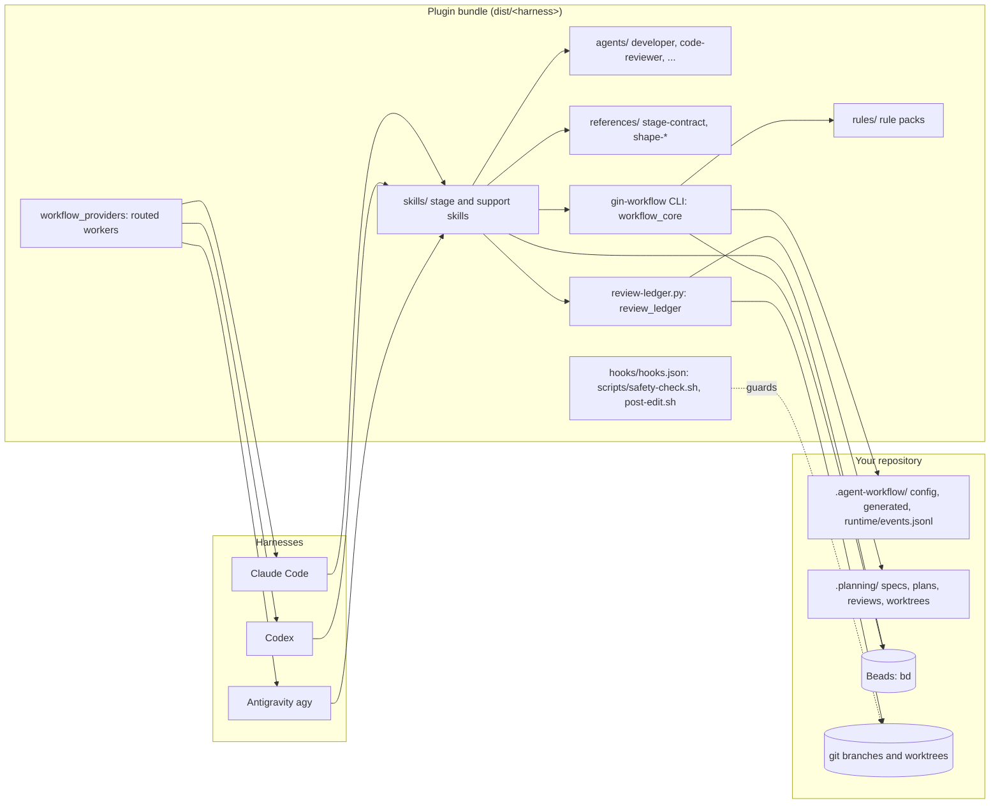
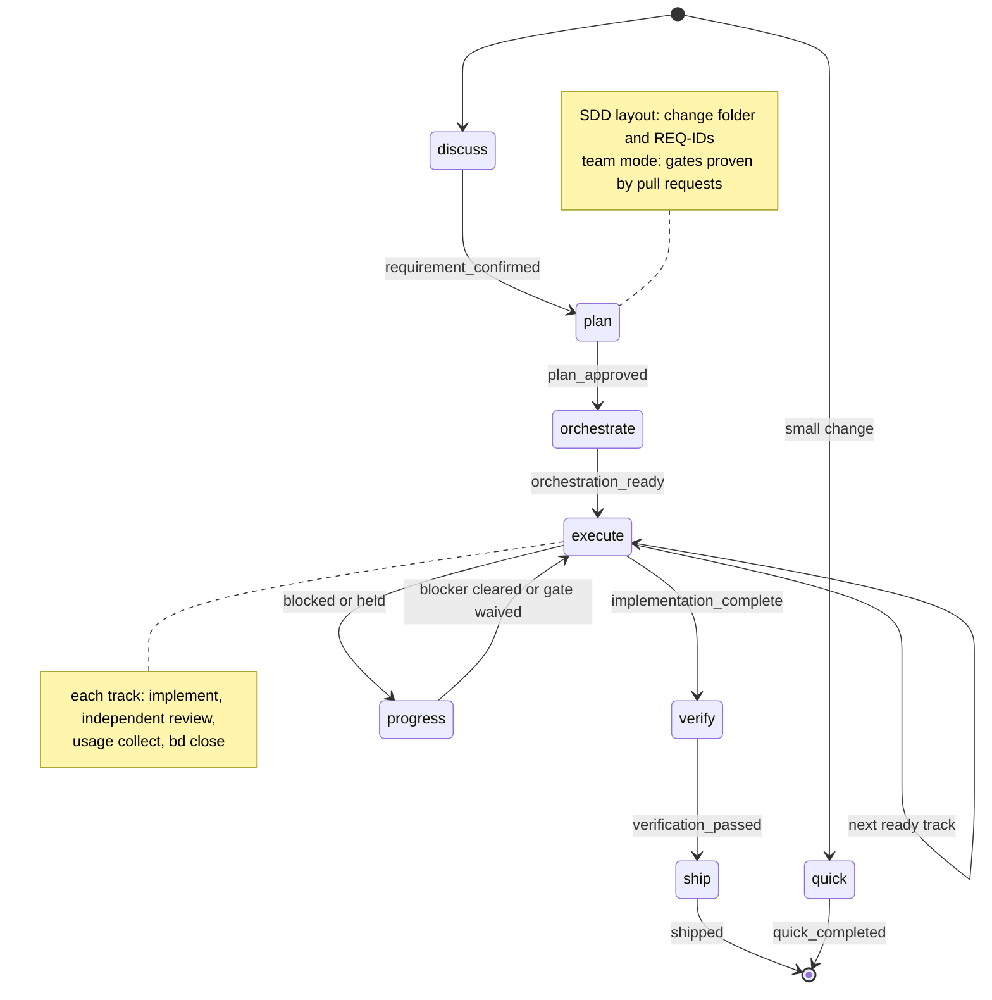
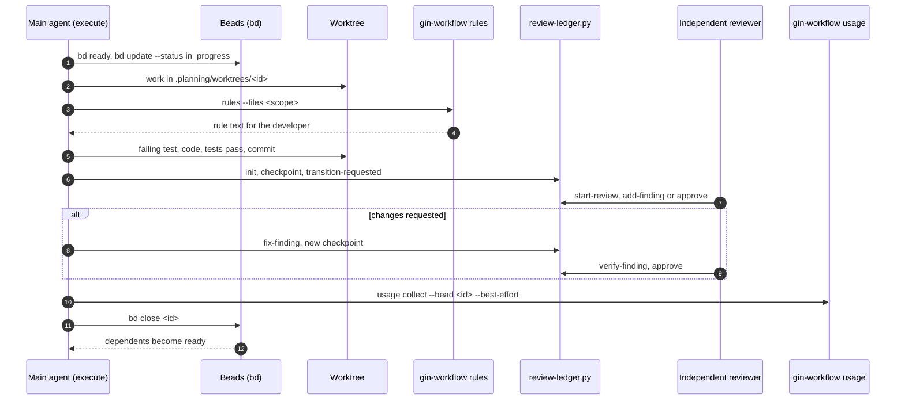
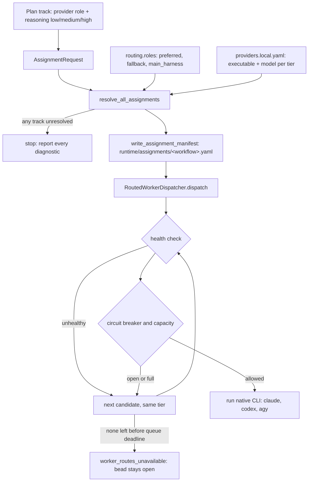
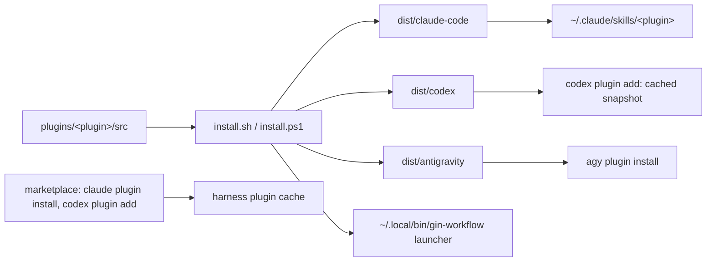
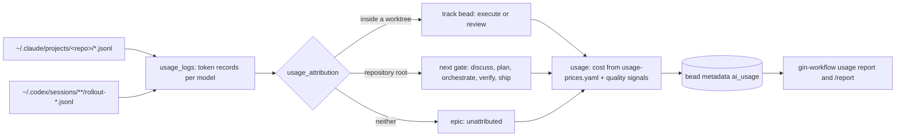

# Architecture

gin-workflow is a plugin for Claude Code, Codex, and Antigravity that walks a change from requirement to merge through recorded gates. Skills tell the agent what to do at each stage; a small Python CLI keeps durable state honest; Beads tracks the work. This page shows how the pieces fit. Each diagram links to the page that covers it in detail.

## Components

The harness loads skills; skills call `gin-workflow` for configuration, gates, rules, specs, team mode, and usage, `review-ledger.py` for reviews, and `bd` for tasks. Nothing outside the repository holds workflow state except Beads and the harness logs that `usage collect` reads. See [State model](state-model.md) for who owns what.

## Lifecycle

Each arrow is a gate recorded with `gin-workflow record` or derived from Beads. `gin-workflow state` evaluates the gates and names exactly one next stage, or holds at `progress` with remedies. A process gate can be waived with a reason; a safety gate needs a follow-up bead. See [Lifecycle](lifecycle.md).

## One track, from claim to close

A track closes when its tests pass and its review is approved, without waiting for a merge; that unblocks the next track. The reviewer runs on a different provider (or session) than the implementer, within `routing.review.max_cycles`. See [Lifecycle](lifecycle.md#execute-and-review).

## Provider routing

Plans name roles and reasoning tiers only; concrete providers and models come from machine-local configuration at orchestration and are rechecked at dispatch. Fallback never lowers the reasoning tier. See [Providers](providers.md).

## Build and install

The installer rebuilds `dist/` from `src/` for each selected platform and registers it with the harness. Each harness keeps a snapshot, so a fix committed to this repository reaches a machine only after the install runs again there. A marketplace install copies the plugin but not the `gin-workflow` launcher. See [Troubleshooting](../reference/troubleshooting.md).

## Usage collection

`execute` and `ship` run `usage collect` before closing a bead; it reads only token counts and routing fields, never prompt text, and never blocks closing. See [Usage report](../guides/usage-report.md).
