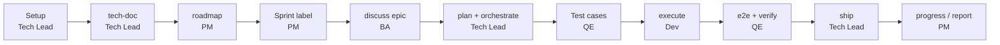

# Brownfield Walkthrough: From Legacy Code to Sprint Delivery

This walkthrough follows one team from "we inherited a legacy system" to "sprint work is shipped". Each stage lists who runs it, the prompt to paste, what you get, the gate or approval, and the mistakes to avoid. A slide version for onboarding the team is in [brownfield-onboarding.html](../presentations/brownfield-onboarding.html).

## The scenario

A legacy PHP ordering system (orders, payments, inventory) is being modernized behind a new API. The team:

| Person | Role | Does |
|---|---|---|
| Lan | `pm` | Roadmap, sprint labels, sprint report |
| An | `ba` | Specs and user stories |
| Binh | `be_lead` | Setup, plan, orchestrate, ship |
| Em | `be_dev` | Implementation |
| Chi | `qe` | Test cases, E2E, verification approval |

The `team:` block in `.agent-workflow/config.yaml` (written by `/gin-workflow:team-setup`):

```yaml
team:
  host: github
  commit_convention: conventional
  members:
    lan@example.com: {roles: [pm], login: lan-pm}
    an@example.com: {roles: [ba], login: an-ba}
    binh@example.com: {roles: [be_lead], login: binh-dev}
    em@example.com: {roles: [be_dev], login: em-dev}
    chi@example.com: {roles: [qe], login: chi-qe}
  areas:
    legacy_core: {paths: ["legacy/**"], lead: be_lead, roles: [be_dev]}
    modern_api: {paths: ["src/**", "tests/**"], lead: be_lead, roles: [be_dev]}
  approvals:
    requirement_confirmed: [ba, be_lead]
    plan_approved: area_lead
    verification_passed: [qe]
    roadmap: [pm, be_lead]
```

A gate is never approved by the author of its pull request, so each approving role needs a second holder. Here Lan has no second `pm` and An no second `ba`, so Binh (`be_lead`) approves their roadmap and spec pull requests.

## The flow at a glance



## 1. Setup

**Who:** Tech Lead once per repository, then every member once on their own clone. Members do not register themselves: the lead lists every member, role, area, and approval in the `team:` block.

**Prompt (Tech Lead)**
```text
/gin-workflow:setup
/gin-workflow:team-setup
```
Answer `team-setup` as the lead. It writes the `team:` block, runs `gin-workflow team init` (add `--ci` for a CI workflow), then you commit on a branch, push, and open a pull request. Merge it.

**Prompt (each member, after pulling the merged branch)**
```text
/gin-workflow:team-setup
```
Answer as a member. It checks `gin-workflow team whoami` finds your `git config user.email`, installs the commit-msg hook (`gin-workflow team hooks`), asks you to log in (`gh auth login` or `glab auth login`), runs `bd init --remote <remote>` when the team shares Beads, and ends with `gin-workflow setup doctor`. Nothing is written back to the repository.

**You get:** `.agent-workflow/config.yaml` with the `team:` block, `.github/CODEOWNERS` (`.gitlab/CODEOWNERS` on GitLab), a pull request template, and a commit-msg hook on every clone.

**Gate or approval:** none. The lead protects the base branch on the host (pull request, one approval, "Require review from Code Owners") and, for the CI job to run `team codeowners --check`, sets the repository variable `GIN_WORKFLOW_INSTALL`.

**Common mistakes:** forgetting to add a member or the PM to `members` (the `roadmap` approval then fails with "role pm is held by no member"; fixing it takes another pull request); a member whose git email differs from the one in `members` (`team whoami` finds nothing); skipping the host login.

## 2. Survey the legacy system

**Who:** Tech Lead.

**Prompt**
```text
/gin-workflow:tech-doc whole repository
```

**You get:** the tech-doc set under `.planning/codebase/` (or `docs/codebase/` with the SDD layout): overview, architecture, stack, conventions, testing, and concerns, one file per topic (`OVERVIEW`, `FEATURES`, `API`, `STACK`, `INTEGRATIONS`, `ARCHITECTURE`, `STRUCTURE`, `CONVENTIONS`, `TESTING`, `CONCERNS`).

**Gate or approval:** none. Review it with the team; the roadmap is only as good as this survey.

**Common mistakes:** documenting only the parts you plan to touch first; the roadmap needs the whole as-is picture to place dependencies correctly.

## 3. Roadmap

**Who:** PM.

**Prompt**
```text
/gin-workflow:roadmap Goal: move payments and inventory out of the monolith within two quarters without downtime.
```

**You get:** the skill reads every file of the tech-doc set, asks about goals, capacity, and constraints, proposes two or three ways to split the work, and shows the roadmap for your confirmation. After you confirm it writes `.planning/roadmap.md` (`docs/roadmap.md` with the SDD layout) on branch `roadmap/<topic>`.

**Gate or approval:** with `team.approvals.roadmap: [pm, be_lead]`, the roadmap goes through a pull request that Binh approves (Lan cannot approve her own). Run the prompt again with the PR URL; the skill checks it with `gin-workflow team check <url> --gate roadmap`, then creates the epics `<prefix>-rm-<slug>` (label `roadmap`) with their dependencies in Beads.

**Common mistakes:** editing epic ids in the roadmap file later (ids never change once written); expecting the roadmap to close or delete epics when you remove them from the file (it only reports them).

## 4. Sprint planning

**Who:** PM.

**Prompt**
```text
/gin-workflow:roadmap Label demo-rm-payments and demo-rm-orders-api for sprint 2026-s1.
```

**You get:** the chosen epics carry the label `sprint:2026-s1`. A sprint is only a label: `bd list --label sprint:2026-s1` shows it.

**Gate or approval:** none.

**Common mistakes:** labelling an epic whose dependencies are not done; `bd ready` still hides blocked epics, so check it.

## 5. Discuss an epic

**Who:** BA.

**Prompt**
```text
/gin-workflow:discuss demo-rm-payments
```

**You get:** the discussion starts from the epic and its roadmap entry and reuses it (no new epic). The spec is built from the `design-spec.md` template (or `proposal.md` with the SDD layout) and has a `## User Stories` section. Every story has acceptance criteria and, with REQ-IDs, a `REQ:` line.

**Gate or approval:** the spec is committed on `spec/<topic>` and opened as a pull request. With `requirement_confirmed: [ba, be_lead]`, Binh approves it (An cannot approve his own); the gate is recorded with the PR URL after the merge.

**Common mistakes:** creating a second epic by hand; stories without acceptance criteria.

## 6. Plan and orchestrate

**Who:** Tech Lead.

**Prompt**
```text
/gin-workflow:plan
/gin-workflow:orchestrate
```

**You get:** a plan with tracks per area and owner (`team check-plan` must pass), then track beads under the reused epic, an isolated worktree, and dependencies.

**Gate or approval:** with `plan_approved: area_lead`, the area lead approves the plan pull request.

**Common mistakes:** a track that touches two areas; run `gin-workflow team check-plan <plan>` before asking for approval.

## 7. Test cases

**Who:** QE.

**Prompt**
```text
/gin-qa:cases payments
```

**You get:** `qa/cases/payments.md`, one case per scenario, each tied to a requirement and its content hash. `gin-qa cases plan` later flags cases that went stale.

**Gate or approval:** none.

**Common mistakes:** writing cases before the spec is merged; they would point at requirements that can still change.

## 8. Execute

**Who:** Developer.

**Prompt**
```text
/gin-workflow:execute
```
In team mode `execute` runs `gin-workflow team deps`, picks from `gin-workflow team ready`, and claims with `gin-workflow team claim <bead>`; run them yourself first to choose a track.

**You get:** one track implemented test-first in the worktree, an independent review, a closed track bead, and a pushed feature branch.

**Gate or approval:** `execute` refuses a `roadmap` epic that has no confirmed spec; run stage 5 first. The claim fails if a teammate already holds the track.

**Common mistakes:** working outside the track's file scope; closing the bead before the review finishes.

## 9. E2E and verify

**Who:** QE.

**Prompt**
```text
/gin-qa:e2e payments
/gin-workflow:verify
```

**You get:** Playwright specs under `qa/e2e/`, evidence under `qa/evidence/`, and the verification record.

**Gate or approval:** with `verification_passed: [qe]`, the QE approves the latest commit of the developer's pull request. A later push needs a new approval.

**Common mistakes:** approving before the last commit; a push after approval silently invalidates it.

## 10. Ship and sprint review

**Who:** Tech Lead ships; PM reviews the sprint.

**Prompt**
```text
/gin-workflow:ship
/gin-workflow:progress sprint 2026-s1
/gin-workflow:report --sprint 2026-s1
```

**You get:** the merged deliverable, a per-epic status of the sprint (`progress`), and a cost and usage report for the sprint's epics and their tracks (`report`).

**Gate or approval:** merging into the base branch needs explicit approval.

**Common mistakes:** reading the report before `usage collect` ran on closed tracks; tracks without a summary show as `not collected`.

## Customizing outputs

Every artifact starts from a template. Copy a template to `.agent-workflow/templates/<name>` and edit it; the override wins in every stage and every layout.

| Template | Used by | Override file |
|---|---|---|
| Roadmap | `roadmap` | `.agent-workflow/templates/roadmap.md` |
| Epic description | `roadmap` | `.agent-workflow/templates/epic.md` |
| User story | `discuss` | `.agent-workflow/templates/user-story.md` |
| Design spec (legacy layout) | `discuss` | `.agent-workflow/templates/design-spec.md` |
| Proposal (SDD layout) | `discuss` | `.agent-workflow/templates/proposal.md` |

Print the current text with `gin-workflow specs template <file>` (for example `user-story.md`). Example override of `user-story.md` that adds a priority and Vietnamese headings:

```markdown
### US-{{n}}: {{title}}
Ưu tiên: {{priority}}
Là {{role}}, tôi muốn {{goal}}, để {{benefit}}.
REQ: {{reqs}}

Tiêu chí chấp nhận:
-
```

Test cases follow `qa/guidelines.md`, which `/gin-qa:cases` reads first. Example:

```markdown
- Language: Vietnamese.
- One user action per step.
- `Priority: high | medium | low`.
- Extra fields this team uses (kept and exported as-is): `Owner`, `Jira`.
```

## Solo variant

One person plays every role, so the flow shrinks:

- No `team-setup`, no `team:` block, no pull requests for gates: you confirm in chat.
- Stage 3: `/gin-workflow:roadmap` writes the file after you confirm it and creates the epics directly.
- Stage 8: pick work with `bd ready` instead of `team ready`.
- Everything else is the same: `/gin-workflow:discuss <epic-id>`, `plan`, `orchestrate`, `execute`, `verify`, `ship`.
