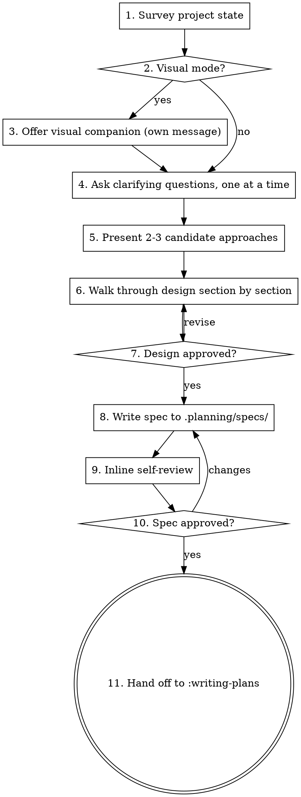

# Brainstorming a design

Turn a fuzzy idea into a written design through targeted questions and tradeoff comparisons. The output is a spec document at `.planning/specs/YYYY-MM-DD-<topic>-design.md` that downstream skills (`:writing-plans`) consume.

This is the entry point of the core workflow. The `/discuss` command invokes this skill. If you call `:brainstorming` directly, the spec output still lives in `.planning/specs/`.

## The single rule

Do not write code, scaffold a project, modify configuration, or invoke any implementation skill until the user has approved the design. This applies to every project — including the ones that "obviously don't need a design".

The reason: every project carries hidden assumptions. Five minutes spent saying them out loud beats an hour of rework. A trivial project gets a trivial design (three sentences may suffice), but it still gets written down and approved.

## Workflow

The flow is linear with two human checkpoints: design approval and spec approval. Track progress with TaskCreate so the user can see where you are.

The terminal state is `:writing-plans`. Do not hand off to any other implementation skill from here.

## Step-by-step

### 1. Survey project state

Read what already exists before asking anything. Skim the README, the relevant directory tree, recent commits, and any `CLAUDE.md` / `AGENTS.md` files at the project root. Questions you ask later should not duplicate facts already on disk.

If `.planning/codebase/*.md` exists from a prior `/map-codebase` run, lean on those documents — they describe the project faster than re-reading source.

### 2. Decide if visuals are coming

If the upcoming questions involve UI layouts, wireframes, side-by-side comparisons, or architecture diagrams, plan to use the visual companion. If the topic is purely conceptual (requirements, tradeoffs, scope decisions), stay in the terminal.

A UI topic is not automatically a visual question. "What does 'guest mode' mean here?" is conceptual — answer in the terminal. "Which of these two layouts works better?" is visual — use the companion.

### 3. Offer the visual companion

If step 2 said "yes", send a single message offering the companion — nothing else in that message:

> Some of the upcoming questions are easier to discuss visually. I can spin up a local browser companion to show mockups, diagrams, and side-by-side comparisons. This is optional and a bit token-heavy. Want to try it?

Wait for the user. If they decline, proceed with text-only. If they accept and a companion implementation is available, see `visual-companion.md` next to this file for the protocol. (Note: in v0.1.0 of this plugin the companion server is not yet bundled; the offer is reserved for forward compatibility.)

For each subsequent question, decide independently whether the companion or the terminal is the better channel.

### 4. Ask clarifying questions, one at a time

Cardinal rule: one question per message. If a topic needs multiple angles, sequence the messages.

Prefer multiple choice ("A: client-side validation only; B: server-side only; C: both — pick one") over open-ended where you can. Multiple choice is faster to answer and forces explicit tradeoffs.

Drive toward three things:

- **Purpose** — what problem does this solve, and for whom?
- **Constraints** — hard rules (latency, compliance, infra, deadlines)?
- **Success criteria** — how do you know it worked?

If the request describes several independent subsystems ("build a platform with chat, billing, analytics, notifications"), stop and decompose first. Pick the smallest sub-project that produces standalone value, run the design loop on that, defer the rest. Each sub-project gets its own spec → plan → implementation cycle.

### 5. Present 2-3 candidate approaches

Conversational, not a checklist. Lead with your recommendation and explain why.

> Recommended: A — `<reason>`. Tradeoff: `<cons>`.
> Alternative: B — `<reason>`. Tradeoff: `<cons>`.
> Fallback: C — only if A and B both blocked. Tradeoff: `<cons>`.

Skip the third option when there are genuinely only two viable approaches. Don't manufacture a third.

### 6. Walk through the design section by section

Cover at minimum: architecture, the smaller units it breaks into, data flow, error handling, testing approach.

Scale each section to the complexity of what it covers. A truly simple section can be three sentences. A nuanced one runs 200–300 words. After each section, ask the user if it looks right before continuing. If they push back, revise on the spot rather than pressing forward.

**Design for small, well-bounded units.** For every unit (module, file, function, component), you should be able to answer:

- What is its single purpose?
- What is its public interface?
- What does it depend on?

If you cannot change the unit's internals without breaking consumers, the boundary is wrong. Fix it in the design, not after implementation.

**In an existing codebase:** survey patterns before proposing changes, and follow what's already there. If a file you'll touch has grown messy enough to harm the work, include a targeted cleanup as part of the design — but never sneak in unrelated refactoring. Stay focused on the current goal.

### 7. Wait for explicit design approval

A noncommittal "okay" or "I guess" is not approval. If the user is hesitating, the design is usually missing something — keep digging until they can say "yes, that's right" without reservation.

### 8. Write the spec to disk

Save the validated design to `.planning/specs/YYYY-MM-DD-<topic>-design.md`. Use today's date and a kebab-case slug.

The file should contain everything an implementer needs to build it without re-asking the user: goals, non-goals, the chosen approach with reasoning, the architecture overview, file structure, error handling decisions, testing strategy, and any open questions or risks. The bar is: a teammate could pick this up tomorrow and proceed.

Commit the spec to git as a separate commit before moving on.

### 9. Inline self-review

Look at the file you just wrote with fresh eyes. Four checks:

1. **Placeholders** — any "TBD", "TODO", or empty section? Fill them.
2. **Internal consistency** — do sections agree with each other? Does the architecture description match the file structure?
3. **Scope** — is this focused enough for a single plan, or does it want decomposition?
4. **Ambiguity** — any requirement two readers could interpret differently? Pick one and state it explicitly.

Fix issues directly. Do not re-review the fixes — just fix and move on.

For specs that are non-trivial or where you suspect a blind spot, optionally dispatch an independent reviewer subagent before step 10. The prompt template lives next to this file at `spec-document-reviewer-prompt.md`. The reviewer is advisory; the user remains the final reviewer in step 10.

### 10. User reviews the spec file

Tell the user where the spec lives and ask them to read it:

> Spec written to `.planning/specs/<filename>`. Please skim it and let me know if anything needs to change before I plan the implementation.

If they request changes, make the edits and re-run step 9. Loop until they approve.

### 11. Hand off to `:writing-plans`

`:writing-plans` is the only skill you invoke after this one. Do not start implementing, do not invoke debugging or refactoring skills. The next step is the plan.

## Anti-pattern: skipping the design because "it's simple"

Every project goes through this loop. Single-function utilities, a config tweak, a typo fix — all of them.

The reason: simple projects are where unstated assumptions sneak in unchecked. The user thinks "fix the typo on the login page" and the implementer thinks "fix typos across the auth module" — and forty minutes get wasted before someone catches the mismatch. The cure is cheap: write down the three-sentence design and have the user nod.

Simple project, simple design. Three sentences may be enough — but those three sentences must exist on disk and be approved.

## Key principles

- **One question per message.** If a topic needs more, send more messages.
- **Multiple choice beats open-ended.** Faster to answer; easier to compare.
- **YAGNI ruthlessly.** Strip features the user didn't ask for. The design captures the request, not the maximally-featured version.
- **Always offer alternatives.** Even with a clear recommendation, show what else was on the table.
- **Validate incrementally.** Per-section approval beats batch approval at the end.
- **Backtrack without ego.** If a question turns out to be the wrong question, say so and ask a better one.

## Where this skill sits

| Aspect | Detail |
|--------|--------|
| Command entry | `/discuss [topic]` |
| Direct skill call | `:brainstorming` |
| Output | `.planning/specs/YYYY-MM-DD-<topic>-design.md` |
| Downstream | `:writing-plans` reads the spec; the caller updates `.planning/STATE.md` to `step: research` after spec approval |
| Required upstream | None — first skill in the pipeline (after optional `/new-project` setup) |
