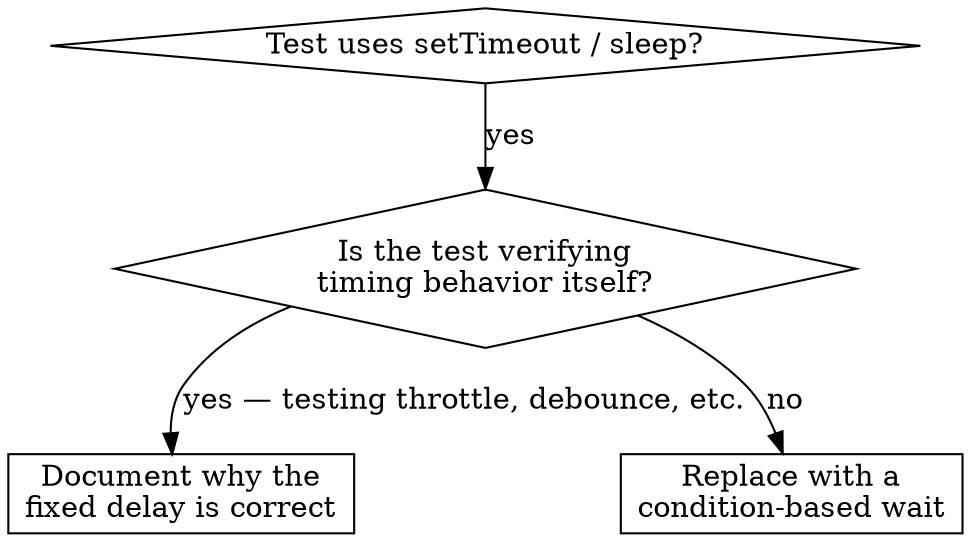

# Condition-based waiting — replacing arbitrary timeouts

Flaky tests usually come from `setTimeout`, `sleep`, or `time.sleep()` calls that guess at how long an async operation takes. The guess works on a fast laptop, fails under CI load, and creates the kind of intermittent failures that erode trust in the test suite.

The fix is structural: stop guessing at duration; wait for the actual condition you care about.

## When to apply



Reach for this when:

- A test has arbitrary delays (`setTimeout`, `sleep`, `time.sleep()`).
- A test is flaky — passes locally, fails under CI load.
- A test times out when the suite runs in parallel.
- You're waiting for an async operation to finish.

Don't reach for this when:

- The test is verifying timing behavior itself (a debounce of 200ms, a throttle interval). In that case, document the delay's rationale clearly.

## The pattern

Before — guessing at duration:

```typescript
await new Promise(r => setTimeout(r, 50));
const result = getResult();
expect(result).toBeDefined();
```

After — waiting for the condition:

```typescript
await waitFor(() => getResult() !== undefined);
const result = getResult();
expect(result).toBeDefined();
```

If 50ms was enough, the new version completes in roughly 50ms. If the system is slow today, it waits longer — until the actual condition is met or the timeout fires.

## Quick patterns

| Scenario | Pattern |
|----------|---------|
| Wait for an event to arrive | `waitFor(() => events.find(e => e.type === 'DONE'))` |
| Wait for a state machine to settle | `waitFor(() => machine.state === 'ready')` |
| Wait for a counter | `waitFor(() => items.length >= 5)` |
| Wait for a file to appear | `waitFor(() => fs.existsSync(path))` |
| Wait for a compound condition | `waitFor(() => obj.ready && obj.value > 10)` |

## A general implementation

```typescript
async function waitFor<T>(
  condition: () => T | undefined | null | false,
  description: string,
  timeoutMs = 5000,
): Promise<T> {
  const startTime = Date.now();

  while (true) {
    const result = condition();
    if (result) return result;

    if (Date.now() - startTime > timeoutMs) {
      throw new Error(`timeout waiting for ${description} after ${timeoutMs}ms`);
    }

    await new Promise(r => setTimeout(r, 10)); // poll every 10ms
  }
}
```

The signature is intentional: the condition can return a value (returned to the caller), and the description shows up in the timeout message so the failure is informative. Polling at 10ms is a reasonable default — fast enough that the test doesn't add noticeable latency, slow enough that the polling itself doesn't dominate CPU on slow machines.

A reference TypeScript implementation with domain-specific helpers (`waitForEvent`, `waitForEventCount`, `waitForEventMatch`) is deferred to a future release — the pattern above covers the common cases.

## Common mistakes

- **Polling too fast.** `setTimeout(check, 1)` busy-loops. 10ms is the sweet spot.
- **No timeout.** A `while (!done)` loop without a timeout will spin forever when the condition never becomes true. Always have a timeout with a descriptive message.
- **Stale data.** If you snapshot the state outside the loop, the loop checks the same value repeatedly. Call the getter *inside* the loop so each iteration sees current state.
- **Asserting inside the condition.** The condition should return a truthy/falsy answer, not call `expect()`. Assertions throw on failure, which means a non-match looks like an exception, which means the timeout never fires.

## When a fixed delay really is correct

Some behavior is genuinely timing-dependent. A throttle that fires every 100ms; a debounce that waits 250ms after the last event; a tool that emits a partial output every 100ms and you want to verify two ticks happened.

When the delay is intrinsic to the behavior under test:

```typescript
await waitForEvent(manager, 'TOOL_STARTED');   // first: wait for the trigger
await new Promise(r => setTimeout(r, 200));    // then: wait the documented two ticks
// 200ms = two ticks at 100ms cadence — documented and justified
```

Three rules apply:

1. Wait for the triggering condition first (so the timer starts at a known moment, not at "whenever the test setup happened to finish").
2. The duration is based on the system's known timing, not a guess.
3. A comment explains why the duration is what it is.

## Real impact

In one debugging session, applying this pattern across 15 flaky tests in three files moved the suite's pass rate from 60% to 100% and cut total execution time by about 40%. The previous "fix" had been bumping the `setTimeout` value higher whenever a test failed; that approach makes flakiness worse over time, not better, because slow machines need ever-larger guesses.

The structural answer is to wait for the condition, with a timeout that's a real budget rather than a guess.
