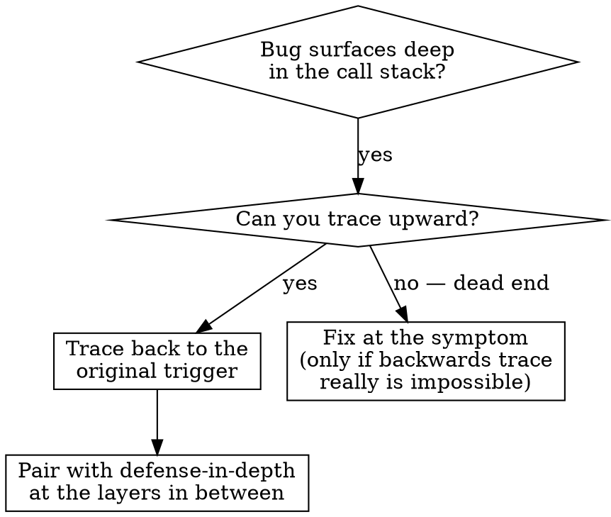
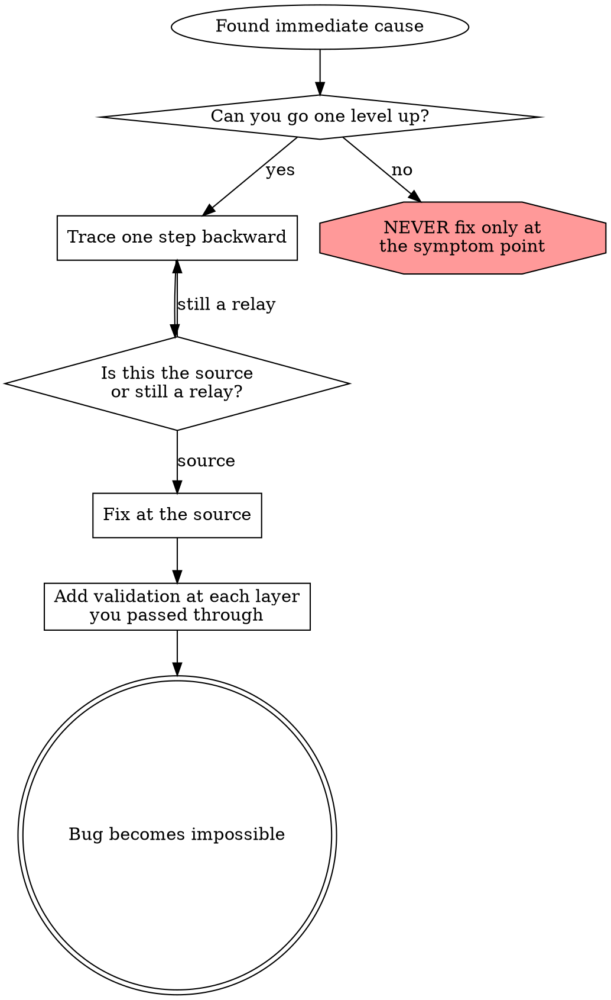

# Root cause tracing — backward through the call stack

Reach for this technique when the bug surfaces deep in execution but you suspect the *cause* lives further up the stack. The instinct is to fix where the error appears; the discipline is to trace backward until you find the original trigger and fix at the source.

## When to use it



Reach for this when:

- The error happens far from the entry point.
- The stack trace shows a long call chain.
- It's unclear where the invalid data first appeared.
- You need to identify which test or code path triggers the problem.

## The trace

### 1. Observe the symptom

Be precise about *what* the failure looks like at the moment it surfaces:

```
git init failed in ~/project/packages/core
```

### 2. Find the immediate caller

What code directly produced the failure?

```typescript
await execFileAsync('git', ['init'], { cwd: projectDir });
```

### 3. Ask "what called this?"

Walk one step up the call chain:

```
WorktreeManager.createSessionWorktree(projectDir, sessionId)
  ← Session.initializeWorkspace()
  ← Session.create()
  ← test setup at Project.create(...)
```

### 4. Inspect the value at each level

What was passed in?

- `projectDir = ''` — empty string.
- An empty `cwd` falls through to `process.cwd()`.
- `process.cwd()` is the source code directory!

Now you know the immediate cause: the code did exactly what it was told, with the wrong input.

### 5. Find the original trigger

Where did the empty string come from?

```typescript
const context = setupCoreTest();   // returns { tempDir: '' } at module load time
Project.create('name', context.tempDir);  // accessed before beforeEach()!
```

Root cause: a top-level expression read `tempDir` before `beforeEach` had a chance to set it. The empty string then propagated five layers down to where it caused visible damage.

The fix lives at step 5 (make `tempDir` a getter that throws when accessed too early), not at step 1 (don't try to `git init` an empty path). The step-1 fix would only mask the bug; the step-5 fix makes it impossible.

## When you can't trace manually — add stack traces

When the call chain is too tangled to follow by reading code, instrument the suspect operation:

```typescript
async function gitInit(directory: string) {
  const stack = new Error().stack;
  console.error('[DEBUG-trace] git init', {
    directory,
    cwd: process.cwd(),
    nodeEnv: process.env.NODE_ENV,
    stack,
  });

  await execFileAsync('git', ['init'], { cwd: directory });
}
```

Notes:

- Use `console.error()` in tests, not the project's logger — loggers may suppress output during tests, but stderr always survives.
- Log *before* the dangerous operation, not in a `catch` block — by the time the catch fires, the value you cared about may already be lost.
- Include enough context: directory, cwd, environment variables, timestamps.
- Use a recognizable tag (`[DEBUG-trace]`) so you can grep the noise out and remove every line in Phase 6.

Then run with the instrumentation and capture the output:

```bash
npm test 2>&1 | grep '\[DEBUG-trace\]'
```

The stack traces show:

- Which test file or call site triggered the bad value.
- Which line in that file made the call.
- Whether the same trigger appears repeatedly or only once (a hint about the trigger's nature).

## Finding which test pollutes the environment

When something appears during the test suite but you can't tell which test produced it, run tests one by one until you reproduce the artifact. The bisection technique is mechanical:

1. Run the suite, observe the artifact.
2. Run half the tests, see if the artifact appears.
3. If yes, half of those; if no, the other half. Repeat.

Bash bisection scripts exist for this; one is deferred to v0.2.0 of this plugin and not bundled today. The technique is what matters — write a small wrapper in your test runner of choice if needed.

## A worked example

**Symptom:** a `.git` directory appeared inside `packages/core/` (the source tree).

**Trace:**

1. `git init` ran with `cwd = process.cwd()` because of an empty `cwd` parameter.
2. `WorktreeManager` had been called with `projectDir = ''`.
3. `Session.create()` had been passed an empty string.
4. The test had read `context.tempDir` before `beforeEach` initialized it.
5. `setupCoreTest()` returns `{ tempDir: '' }` at module load.

**Root cause:** a top-level `const` accessing `tempDir` too early.

**Fix:** turn `tempDir` into a getter that throws if read before `beforeEach` runs.

**Defense-in-depth (separate technique, see `defense-in-depth.md`):**

- Layer 1: `Project.create()` validates `workingDirectory` is non-empty and exists.
- Layer 2: `WorkspaceManager` validates `projectDir` is non-empty.
- Layer 3: `gitInit` refuses to run outside the system temp dir during `NODE_ENV=test`.
- Layer 4: stack-trace logging right before the `git init` call.

After: 1847 tests passed. The `.git`-in-source-tree pattern became impossible to recreate.

## Tips that pay off

- In tests, use `console.error()` instead of the project logger.
- Log *before* the operation, not after it fails — failure may erase the input.
- Capture `new Error().stack` rather than relying on the runtime's own trace; it's more portable.
- Always include the time, the relevant environment variables, and the actual value of every parameter to the suspect call.

## The principle



The temptation is to fix where the error happened. Resist it. Trace until you find the original trigger; fix there. If a layer in between is reachable from another path, add a guard there too — that's defense-in-depth.

## Real impact

In a recent debugging session, this technique:

- Found a root cause through a five-level trace.
- Fixed at the source (a getter validation).
- Combined with four defense-in-depth layers between the source and the symptom.
- Resulted in 1847 tests passing with zero test pollution remaining.

Time spent on the trace: about 20 minutes. Time previously spent on guess-and-check fixes that didn't stick: several hours.
