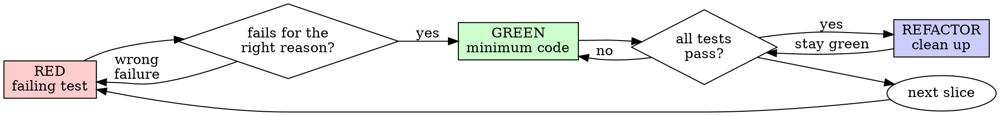

# Test-driven development

Write a failing test that describes the change in observable terms. Run it and watch it fail for the right reason. Write the smallest code that makes it pass. Run it again. Refactor if needed. Commit. Repeat for the next slice.

## The core rule

**No production code without a failing test that came first.**

If you wrote code before the test, the test is no longer testing what you think it tests — you wrote it knowing the answer, and your test will likely follow the shape of the implementation rather than the shape of the requirement. Delete the code, write the test from scratch against the requirement, watch it fail, then implement.

This is not about ritual. The order matters because:

- A test that has never failed proves nothing about whether it can detect a bug.
- Writing the test first forces you to articulate the requirement before you have an answer in mind.
- Tests written after the fact are biased toward the implementation; they verify what the code does rather than what it should do.

## Tests verify behavior through public interfaces

A good test exercises the change the way a real caller would. It reads like a small story: given X, the public API does Y, and you can observe Y from the outside.

A bad test pokes at internal collaborators with mocks. It often passes because the mock was set up to return what the test expects, not because the code is correct. When the implementation is refactored — without changing behavior — the bad test breaks.

The test you want to keep is the one that survives a refactor of the internals. If a refactor that doesn't change observable behavior breaks the test, the test was coupled to the implementation.

## When TDD applies

| Situation | Apply TDD? |
|-----------|-----------|
| New feature | Yes |
| Bug fix | Yes — the test reproduces the bug, the fix makes it pass |
| Refactor | Yes — the test pins down the existing behavior so the refactor doesn't drift |
| Behavior change | Yes |
| Throwaway prototype, spike, exploration | Optional — discuss and record the decision |
| Pure config / generated code | Often skipped — the test would be tautological |

If you're tempted to think "skip the test just this once for this real change", that's a rationalization. Stop and write the test.

## Red, green, refactor



### RED — write a failing test

Pick one observable behavior. Write the smallest test that exercises it. The test should read like a description of the requirement.

Good:

```typescript
test('retries failed operations up to three times', async () => {
  let attempts = 0;
  const operation = () => {
    attempts++;
    if (attempts < 3) throw new Error('not yet');
    return 'success';
  };

  const result = await retryOperation(operation);

  expect(result).toBe('success');
  expect(attempts).toBe(3);
});
```

A clear name. Real input, real output. One observable behavior.

Not good:

```typescript
test('retry works', async () => {
  const mock = jest.fn()
    .mockRejectedValueOnce(new Error())
    .mockRejectedValueOnce(new Error())
    .mockResolvedValueOnce('success');
  await retryOperation(mock);
  expect(mock).toHaveBeenCalledTimes(3);
});
```

Vague name. The assertion checks how the mock was called, not what `retryOperation` actually returns. If you swap the implementation for one that retries by re-throwing into a different path, the test still passes — even if the new implementation is broken.

### Verify the failure

Run the test. Required step — never skip.

Confirm three things:

- It fails (not crashes with a syntax or import error).
- The failure message is the one you expected (e.g., "function not defined", "expected 'success' got undefined").
- It fails because the feature is missing, not because of a typo or environment mistake.

If the test passes immediately, it's testing existing behavior — fix the test before continuing.

If it crashes (import error, syntax error, missing fixture), fix the crash and re-run. Don't proceed until the test fails for the *right* reason.

### GREEN — minimum code to pass

Write the smallest implementation that makes the test pass. No optional parameters, no configuration knobs, no "while we're in here" cleanup.

Good:

```typescript
async function retryOperation<T>(fn: () => Promise<T>): Promise<T> {
  for (let i = 0; i < 3; i++) {
    try {
      return await fn();
    } catch (e) {
      if (i === 2) throw e;
    }
  }
  throw new Error('unreachable');
}
```

Just enough.

Not good:

```typescript
async function retryOperation<T>(
  fn: () => Promise<T>,
  options?: {
    maxRetries?: number;
    backoff?: 'linear' | 'exponential';
    onRetry?: (attempt: number) => void;
  }
): Promise<T> {
  // YAGNI — none of these were in the failing test
}
```

Add features when a test asks for them, not before.

### Verify green

Run the test. Required step.

Confirm:

- The new test passes.
- All other tests still pass.
- Output is clean (no unexpected warnings, no flaky retries).

If the new test fails, fix the code, not the test. If unrelated tests fail, fix them now — don't move on with red elsewhere.

### REFACTOR — clean up while green

Now that the test is green, you have a safety net for cleanup:

- Remove duplication
- Improve names that aren't quite right
- Extract helpers that became obvious

Run the test after every change. If green turns red, undo the refactor and try a smaller step. **Don't add behavior in this phase** — refactor is for cleanup, not new features.

### Next

Pick the next observable behavior. Repeat from RED.

## What good tests look like

| Trait | Good | Not good |
|-------|------|----------|
| **Minimal** | One behavior per test. If the name has "and", split it. | `test('validates email and domain and whitespace')` |
| **Clearly named** | The name describes what's being verified | `test('case 1')`, `test('test_function')` |
| **Behavior-focused** | Calls public API; asserts on observable result | Asserts on mock call counts, internal state |
| **Refactor-safe** | Survives an internal restructure that doesn't change behavior | Breaks every time a private helper is renamed |

## Common rationalizations and how to handle them

| Excuse | Reality |
|--------|---------|
| "I'll write tests after, to verify it works" | Tests written after pass instantly. Passing instantly proves nothing — you never saw it catch the bug. |
| "Already manually tested" | Manual checks are ad-hoc and don't re-run when the code changes. |
| "Deleting hours of work to redo with TDD is wasteful" | Sunk cost. Code without a test that ever failed is technical debt — you can't refactor it confidently. |
| "Just keep the existing code and add tests around it" | You'll bias the tests toward what's there. Either delete and start with TDD, or accept that the tests are characterization tests, not behavior tests. |
| "TDD is dogmatic; pragmatic means adapting" | Pragmatic is shipping fewer bugs. TDD does that. The shortcut isn't pragmatic, it's just shorter. |
| "Test-after gets the same coverage" | Coverage isn't the goal. Proof the test detects a regression is the goal. Test-after never sees the test fail. |
| "Hard to test = test is wrong" | Often it means the design is wrong. The test is a usability check on your API. If it's painful, the API is painful. |

## Red flags that say "stop and start over"

- Code was written before the test.
- The test passed on the first run after creation.
- You can't articulate why the test failed before you wrote the implementation.
- You're rationalizing "this case is different".
- You added a helper to the production class only because the test needed it (see anti-patterns).
- You changed the test instead of the code when the test failed.

If any of these apply, the cycle has slipped. Delete what you wrote since the slip and re-enter with RED.

## A worked bug fix

**Bug report:** the form accepts an empty email field.

**RED**

```typescript
test('rejects an empty email', async () => {
  const result = await submitForm({ email: '' });
  expect(result.error).toBe('Email required');
});
```

**Verify red**

```
$ npm test
FAIL — expected 'Email required', got undefined
```

The right reason: the validation doesn't exist yet.

**GREEN**

```typescript
function submitForm(data: FormData) {
  if (!data.email?.trim()) {
    return { error: 'Email required' };
  }
  // existing logic
}
```

**Verify green**

```
$ npm test
PASS
```

**REFACTOR**

If the codebase has a pattern for field-level validation, extract toward that pattern. If not, leave it.

## Verification checklist before claiming the task done

- [ ] Every public behavior added has a test.
- [ ] You watched each test fail before writing the implementation.
- [ ] Each test failed for the expected reason.
- [ ] You wrote the minimum code to make each test pass.
- [ ] All tests pass and the output is clean.
- [ ] Tests exercise behavior through public interfaces, not by mocking internals.
- [ ] Edge cases that the requirement implies are covered.

If you can't tick every box, TDD slipped — go back and recover.

## When testing is hard, the design is talking

| Symptom | Likely root cause | Move |
|---------|-------------------|------|
| Don't know how to test it | The API isn't clear yet | Write the test you wish existed; let it shape the API |
| Test is more complicated than the code | The interface is overloaded | Split the responsibility |
| Have to mock everything to test anything | The code has too much hidden coupling | Use dependency injection; mock at the external boundary, not inside |
| Test setup is huge | Either move setup into helpers, or simplify what the code requires |

## Connecting to other skills

- For the integration with debugging (writing a regression test before fixing a bug), see `:systematic-debugging` Phase 5. That phase hands back here to author the test.
- For verifying the test passes before claiming done, see `:verification-before-completion`.
- For common mistakes when adding mocks or test-only methods to production classes, see `testing-anti-patterns.md` next to this file.

## Where this skill sits

| Aspect | Detail |
|--------|--------|
| Direct skill call | `:test-driven-development` |
| Used inline by | `:writing-plans` Template A (vertical-slice TDD), `:subagent-driven-development` per-task implementer |
| Optional supporting doc | `testing-anti-patterns.md` |
| Hands off to | `:verification-before-completion` before declaring task done |
