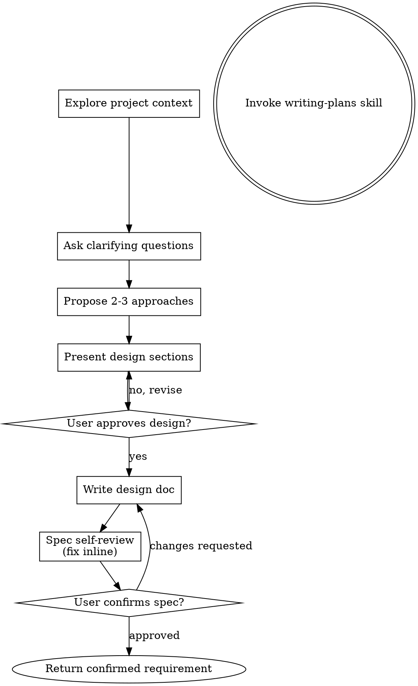

# Discovering Work

Help turn ideas into fully formed designs and specs through natural collaborative dialogue.

Treat this skill as the entry point for requirement discovery and discussion. The user starts with a requirement, not a Beads task. Do not require the user to run manual `bd` commands during normal chat-driven discovery. Use repository context and conversation context to understand the requirement before talking about execution.

Start by understanding the current project context, then ask questions one at a time to refine the idea. Once you understand what you're building, present the design and get user approval.

<HARD-GATE>
Do NOT invoke any implementation skill, write any code, scaffold any project, or take any implementation action until you have presented a design and the user has explicitly confirmed it. This applies to EVERY project regardless of perceived simplicity. Do not create the durable implementation plan or any Beads tasks in this skill.
</HARD-GATE>

## Anti-Pattern: "This Is Too Simple To Need A Design"

Every project goes through this process. A todo list, a single-function utility, a config change — all of them. "Simple" projects are where unexamined assumptions cause the most wasted work. The design can be short (a few sentences for truly simple projects), but you MUST present it and get approval.

## Checklist

You MUST complete these items in order:

1. **Explore project context** — check files, docs, recent commits
2. **Ask clarifying questions** — one at a time, understand purpose/constraints/success criteria, identify missing information, edge cases, risks, dependencies, and assumptions
3. **Propose 2-3 approaches** — with trade-offs and your recommendation. Challenge assumptions when they create risk.
4. **Present design** — in sections scaled to their complexity, get user approval after each section
5. **Write design doc** — save to `.planning/specs/YYYY-MM-DD-<topic>-design.md` (Committing follows the repo explicit-authorization rule)
6. **Spec self-review** — quick inline check for placeholders, contradictions, ambiguity, scope
7. **User reviews written spec** — summarize final understanding clearly and wait for explicit user confirmation
8. **Transition to planning** — return state showing `requirement_confirmed=true` so workflow can transition to planning (`/plan` or `writing-plans`)

## Process Flow

**The terminal state is requirement confirmation.** Do NOT invoke implementation or plan writing skills directly within the requirement discovery stage. Return state showing `requirement_confirmed=true` so the workflow can route to `plan` or `writing-plans`.

## The Process

**Understanding the idea:**

- Check out the current project state first (files, docs, recent commits)
- Before asking detailed questions, assess scope: if the request describes multiple independent subsystems (e.g., "build a platform with chat, file storage, billing, and analytics"), flag this immediately. Don't spend questions refining details of a project that needs to be decomposed first.
- If the project is too large for a single spec, help the user decompose into sub-projects: what are the independent pieces, how do they relate, what order should they be built? Then brainstorm the first sub-project through the normal design flow. Each sub-project gets its own spec → plan → implementation cycle.
- For appropriately-scoped projects, ask questions one at a time to refine the idea
- Prefer multiple choice questions when possible, but open-ended is fine too
- Only one question per message - if a topic needs more exploration, break it into multiple questions
- Focus on understanding: purpose, constraints, success criteria

**Exploring approaches:**

- Propose 2-3 different approaches with trade-offs
- Present options conversationally with your recommendation and reasoning
- Lead with your recommended option and explain why
- Suggest improvements, alternatives, or stronger approaches when appropriate.

**Presenting the design:**

- Once you believe you understand what you're building, present the design
- Scale each section to its complexity: a few sentences if straightforward, up to 200-300 words if nuanced
- Ask after each section whether it looks right so far
- Cover: architecture, components, data flow, error handling, testing
- Be ready to go back and clarify if something doesn't make sense

**Design for isolation and clarity:**

- Break the system into smaller units that each have one clear purpose, communicate through well-defined interfaces, and can be understood and tested independently
- For each unit, you should be able to answer: what does it do, how do you use it, and what does it depend on?
- Can someone understand what a unit does without reading its internals? Can you change the internals without breaking consumers? If not, the boundaries need work.
- Smaller, well-bounded units are also easier for you to work with - you reason better about code you can hold in context at once, and your edits are more reliable when files are focused. When a file grows large, that's often a signal that it's doing too much.

**Working in existing codebases:**

- Explore the current structure before proposing changes. Follow existing patterns.
- Where existing code has problems that affect the work (e.g., a file that's grown too large, unclear boundaries, tangled responsibilities), include targeted improvements as part of the design.
- Don't propose unrelated refactoring. Stay focused on what serves the current goal.

## After the Design

**Documentation:**

- Write the validated design (spec) to `.planning/specs/YYYY-MM-DD-<topic>-design.md`
- Committing follows the repo explicit-authorization rule. Do not auto-commit.

**Spec Self-Review:**
After writing the spec document, look at it with fresh eyes:

1. **Placeholder scan:** Any "TBD", "TODO", incomplete sections, or vague requirements? Fix them.
2. **Internal consistency:** Do any sections contradict each other? Does the architecture match the feature descriptions?
3. **Scope check:** Is this focused enough for a single implementation plan, or does it need decomposition?
4. **Ambiguity check:** Could any requirement be interpreted two different ways? If so, pick one and make it explicit.

Fix any issues inline. No need to re-review — just fix and move on.

**User Review Gate:**
After the spec review loop passes, summarize the final understanding clearly and ask the user to explicitly confirm before proceeding:

> "Spec written to `<path>`. Please review it and let me know if you want to make any changes before we start writing out the implementation plan."

Wait for the user's response. If they request changes, make them and re-run the spec review loop. Only proceed once the user approves.

**Next Step:**

- Return state showing `requirement_confirmed=true`.
- Transition to `writing-plans` (or `/plan`) for durable plan creation.

## Key Principles

- **One question at a time** - Don't overwhelm with multiple questions
- **Multiple choice preferred** - Easier to answer than open-ended when possible
- **YAGNI ruthlessly** - Remove unnecessary features from all designs
- **Explore alternatives** - Always propose 2-3 approaches before settling
- **Incremental validation** - Present design, get approval before moving on
- **Be flexible** - Go back and clarify when something doesn't make sense

## Exit Standard

This phase is complete only when:

1. The requirement is understood deeply enough to plan.
2. The user and agent have aligned on scope, constraints, and success criteria.
3. The final understanding has been summarized clearly.
4. The user has explicitly confirmed that understanding.
5. The next action is clearly to invoke `writing-plans` (or `/plan`).
