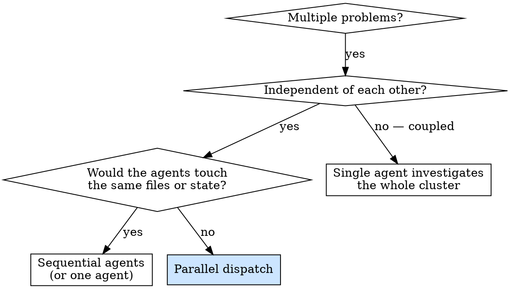

# Dispatching parallel agents

Sequential investigation of independent problems wastes time. When three test files are failing for unrelated reasons, three subagents working in parallel finish in roughly the time of one. The savings come from the fact that an agent's wall-clock time is dominated by reading files and reasoning, not by raw compute.

The skill is about identifying when problems are *actually* independent and dispatching them with sharp enough scope that the agents don't trip over each other.

## When parallel dispatch applies



Dispatch in parallel when:

- Three or more problems exist with different root causes.
- Each problem can be understood without context from the others.
- The agents won't edit overlapping files or rely on shared state.

Don't dispatch in parallel when:

- The problems may share a root cause — fix one and you might fix all of them. Investigate together first.
- Understanding the issue requires seeing the full system at once.
- You're still in exploratory mode and don't yet know what's broken.
- The agents would write to overlapping files or otherwise interfere.

## The pattern

### 1. Identify independent domains

Group failures by what's actually broken. The grouping is honest only if "fixing A doesn't help B" holds for every pair.

Example from a real session:

- File A — tool approval flow
- File B — batch completion behavior
- File C — abort functionality

These are three different subsystems. A fix to abort doesn't change tool approval. The grouping passes the test.

### 2. Write one focused prompt per agent

Each agent's prompt should give them:

- **Specific scope** — one test file, one subsystem, one bug.
- **Clear goal** — "make these tests pass" or "find and fix the bug that makes X happen".
- **Constraints** — what they should not change, in particular files outside their scope.
- **Expected output** — a short summary of what they found and what they changed.

A good prompt:

```
Fix the three failing tests in src/agents/agent-tool-abort.test.ts:

1. "should abort tool with partial output capture" — expects 'interrupted at' in the message.
2. "should handle mixed completed and aborted tools" — fast tool aborted instead of completed.
3. "should properly track pendingToolCount" — expects 3 results but gets 0.

These are timing or race-condition issues.

Your task:
1. Read the test file and understand what each test verifies.
2. Identify root cause — timing problem, or actual bug?
3. Fix by:
   - Replacing arbitrary timeouts with event-based waiting (see
     skills/systematic-debugging/condition-based-waiting.md).
   - Fixing real bugs in the abort implementation if you find them.
   - Adjusting test expectations only if the documented behavior actually
     changed and the tests are stale.

Do NOT just bump the timeouts.

Do NOT change files outside src/agents/agent-tool-abort.test.ts and the abort
implementation it covers.

Return: a one-paragraph summary of root cause and what you changed.
```

A bad prompt: "Fix all the failing tests." Too broad — the agent will lose focus.

### 3. Dispatch the agents in the same turn

Use the Task tool (or your platform's equivalent) to launch the agents in a single message. Most platforms run them concurrently when batched together; check your platform docs if you're unsure.

```
Task tool batch:
  agent-1: Fix agent-tool-abort.test.ts failures (prompt above)
  agent-2: Fix batch-completion-behavior.test.ts failures (prompt similar shape)
  agent-3: Fix tool-approval-race-conditions.test.ts failures (prompt similar shape)
```

### 4. Integrate the results

When the agents return:

- Read each summary.
- Spot-check the diff for each agent — agents can make systematic mistakes that the summary glosses over.
- Verify the changes don't conflict (overlapping edits to the same file, or contradictory choices in adjacent code).
- Run the full test suite and confirm nothing else broke.

If two agents converged on the same bug, integrate one of the fixes and discard the other. If they conflict semantically (e.g., one removes a method the other relies on), pick a single version and re-dispatch the affected agent with a corrected scope.

## Common mistakes

| Mistake | Fix |
|---------|-----|
| Scope too broad | Narrow to one file or one subsystem per agent |
| No context in the prompt | Paste the error message, the test name, the symptom |
| No constraints on the agent | Spell out what files / behavior should NOT change |
| Vague output expectation | "Return a summary of root cause and changes" |
| Parallel dispatch on coupled problems | Identify the coupling first; dispatch one agent, not three |
| Assuming agents won't overlap | Audit the file lists in their summaries before integrating |

## When parallel dispatch is the wrong call

- **The failures share a root cause.** Three "test pollution" failures usually have one cause; investigate together so the agents don't all propose narrow fixes that miss the real bug.
- **You don't yet know what's broken.** Exploratory debugging needs context that lives in your head; an agent dispatched too early will guess.
- **Shared state.** If agent A's changes will land in files agent B is reading, the second agent gets stale information. Either sequence them or scope them so the file sets are disjoint.

## A worked example

**Scenario:** six failing tests across three files after a refactor.

**Failures:**

- `agent-tool-abort.test.ts` — three failures, all timing-related.
- `batch-completion-behavior.test.ts` — two failures, tools not executing.
- `tool-approval-race-conditions.test.ts` — one failure, execution count is zero.

**Independence check:** abort logic is separate from batch completion is separate from race conditions in approval. Grouping passes.

**Dispatch:** three focused agents, one per file, each with the constraint "don't change files outside this scope".

**Results:**

- Agent 1: replaced arbitrary timeouts with event-based waits.
- Agent 2: fixed an event-shape bug — `threadId` was nested wrong.
- Agent 3: added a wait for async tool execution to complete.

**Integration:** all three diffs touched disjoint files. Full suite green. Three problems solved in roughly the time of one.

## Verification after agents return

Always verify before declaring done:

1. Read each agent's diff (not just its summary — see `:verification-before-completion`).
2. Confirm the file sets are disjoint or, if they overlap, that the changes are compatible.
3. Run the relevant test suite and confirm there are no new failures.
4. Spot-check at least one of the changes by hand. Agents make systematic errors more often than random ones.

## Where this skill sits

| Aspect | Detail |
|--------|--------|
| Direct skill call | `:dispatching-parallel-agents` |
| Used by | `/map-codebase` (parallel codebase-mapper agents), `:systematic-debugging` Phase 4 when multiple boundaries need instrumentation, ad-hoc investigation of unrelated bugs |
| Hands off to | `:verification-before-completion` after integrating the results |
| Sister skill | `:subagent-driven-development` — sequential per-task subagents with two-stage review |
