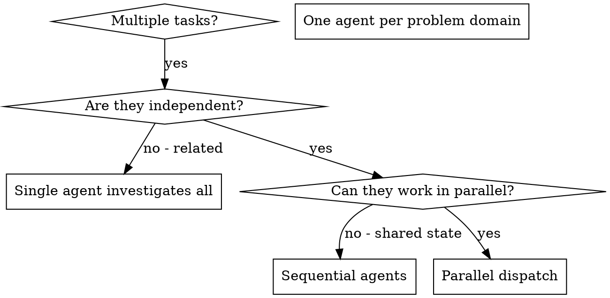

# Dispatching Parallel Agents

## Required Inputs

- resolved `EffectiveConfig`
- `ArtifactRegistry`
- `ContextManifest(stage="execute")`
- native-harness `ApprovalDecision`

## Overview

You delegate tasks to specialized agents (workers) with isolated context. By precisely crafting their instructions and context, you ensure they stay focused and succeed at their task. They should never inherit your session's full context or history — you construct exactly what they need. This also preserves your own context for coordination work.

When you have multiple unrelated failures or tasks (different test files, different subsystems, different features), investigating or implementing them sequentially wastes time. Each task is independent and can happen in parallel.

**Core principle:** Dispatch one agent per independent problem domain. Let them work concurrently.

## When to Use



**Use when:**
- 3+ test files failing with different root causes
- Multiple subsystems broken or needing implementation independently
- Each problem can be understood without context from others
- No shared state between investigations/tasks

**Don't use when:**
- Failures or tasks are related (fixing/implementing one affects others)
- Need to understand full system state
- Agents would interfere with each other (e.g., editing the same files)

## The Pattern

### 1. Identify Independent Domains

Group failures or work items by what they affect:
- Domain A: Tool approval flow tests
- Domain B: Batch completion behavior tests
- Domain C: Abort functionality tests

Each domain is independent.

### 2. Create Focused Agent Tasks with Bounded Context

Give each worker only its necessary bounded context:
- **Durable Task:** Specific scope and goal (e.g., one test file or subsystem)
- **Dependencies:** State explicitly what needs to be ready
- **Approved File Scope:** Limit which files they can edit
- **Validation Intent:** How to verify the work
- **On-Demand Discovery References:** Provide precise pointers to knowledge capability

### 3. Dispatch in Parallel

Select worker dispatch only through the configured worker capability. Do not branch on harness names or invoke harness-specific tools directly. Ensure dependency readiness from the task-tracking capability before dispatching.

Issue all parallel dispatches concurrently while enforcing the `EffectiveConfig` concurrency limit:

```text
Worker (Capability): "Fix agent-tool-abort.test.ts failures"
Worker (Capability): "Fix batch-completion-behavior.test.ts failures"
Worker (Capability): "Fix tool-approval-race-conditions.test.ts failures"
# All three run concurrently up to configured limit.
```

**Note:** Execution-strategy changes and production-impacting parallel work require `approval-manager` authorization and durable audit evidence before dispatch.

### 4. Review and Integrate

When agents return:
- Read each summary
- Record dispatch identity and normalized outcomes through the `evidence-manager` capability. Worker metadata remains disposable, not authoritative task state.
- Verify fixes don't conflict
- Run full test suite or validation
- Integrate all changes

Follow [context and evidence policy](../../references/context-and-evidence-policy.md) and [provider contracts](../../references/capability-provider-contracts.md). The configured capability, rather than a named harness or provider command, selects dispatch behavior.

## Agent Prompt Structure

Good agent prompts are:
1. **Focused** - One clear problem domain
2. **Self-contained** - All context needed to understand the problem
3. **Specific about output** - What should the agent return?

```markdown
Fix the 3 failing tests in src/agents/agent-tool-abort.test.ts:

1. "should abort tool with partial output capture" - expects 'interrupted at' in message
2. "should handle mixed completed and aborted tools" - fast tool aborted instead of completed
3. "should properly track pendingToolCount" - expects 3 results but gets 0

These are timing/race condition issues. Your task:

1. Read the test file and understand what each test verifies
2. Identify root cause - timing issues or actual bugs?
3. Fix by:
   - Replacing arbitrary timeouts with event-based waiting
   - Fixing bugs in abort implementation if found
   - Adjusting test expectations if testing changed behavior

Do NOT just increase timeouts - find the real issue.
File Scope: You may only modify src/agents/agent-tool-abort.test.ts and related non-production test utilities.

Return: Summary of what you found and what you fixed.
```

## Common Mistakes

**❌ Too broad:** "Fix all the tests" - agent gets lost
**✅ Specific:** "Fix agent-tool-abort.test.ts" - focused scope

**❌ No context:** "Fix the race condition" - agent doesn't know where
**✅ Context:** Provide the error messages, test names, and bounded context

**❌ No constraints:** Agent might refactor everything
**✅ Constraints:** Define the approved file scope and validation intent

**❌ Vague output:** "Fix it" - you don't know what changed
**✅ Specific:** "Return summary of root cause and changes for the evidence capability"

**❌ Dispatching arbitrarily:** Using ad-hoc tools or ignoring concurrency limits
**✅ Strict capability usage:** Dispatch only through configured worker capability, enforcing effective-config concurrency limits

## When NOT to Use

**Related failures:** Fixing one might fix others - investigate together first
**Need full context:** Understanding requires seeing entire system
**Exploratory debugging:** You don't know what's broken yet
**Shared state:** Agents would interfere (editing same files, using same resources)
**Unapproved strategy:** Production-impacting parallel work without prior authorization

## Verification

After agents return, verify integration:
1. **Review each summary** - Understand what changed and record via `evidence-manager`
2. **Check for conflicts** - Did agents edit same code outside their approved file scope?
3. **Run full suite** - Verify all fixes work together based on validation intent
4. **Spot check** - Agents can make systematic errors
